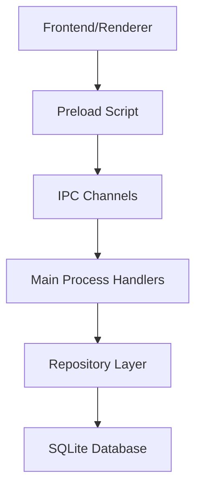

# API Backend - 2ª Coríntios 9

## Visão Geral

A API do backend é implementada através do **Electron Main Process** utilizando **IPC (Inter-Process Communication)** para comunicação segura entre o frontend (renderer) e o backend. A arquitetura segue o padrão Repository com operações CRUD completas para todas as entidades do sistema.

## Arquitetura da API

### Estrutura de Comunicação



### Fluxo de Dados

1. **Frontend** faz chamada através da API exposta
2. **Preload Script** intercepta e envia via IPC
3. **Main Process** recebe e roteia para handler apropriado
4. **Repository** executa operação no banco de dados
5. **Resposta** retorna pelo mesmo caminho

## Endpoints da API

### 1. **Membros (Members)**

#### Criar Membro
```typescript
// Channel: 'create-member'
interface CreateMemberRequest {
  name: string;
}

interface CreateMemberResponse {
  id: number;
  name: string;
}

// Uso no Frontend
const member = await window.electronAPI.createMember({ name: 'João Silva' });
```

#### Listar Todos os Membros
```typescript
// Channel: 'get-all-members'
interface GetAllMembersResponse {
  id: number;
  name: string;
}[]

// Uso no Frontend
const members = await window.electronAPI.getAllMembers();
```

#### Atualizar Membro
```typescript
// Channel: 'update-member'
interface UpdateMemberRequest {
  id: number;
  name: string;
}

// Uso no Frontend
await window.electronAPI.updateMember(1, { name: 'João Santos' });
```

#### Excluir Membro
```typescript
// Channel: 'delete-member'
interface DeleteMemberRequest {
  id: number;
}

// Uso no Frontend
await window.electronAPI.deleteMember(1);
```

### 2. **Dízimos (Tithes)**

#### Criar Dízimo
```typescript
// Channel: 'create-tithe'
interface CreateTitheRequest {
  value: number;
  date: string; // ISO date string
  memberId: number;
}

interface CreateTitheResponse {
  id: number;
  value: number;
  date: string;
  memberId: number;
}

// Uso no Frontend
const tithe = await window.electronAPI.createTithe({
  value: 100.00,
  date: '2024-01-15',
  memberId: 1
});
```

#### Listar Todos os Dízimos
```typescript
// Channel: 'get-all-tithes'
interface GetAllTithesResponse {
  id: number;
  value: number;
  date: string;
  memberId: number;
  memberName: string; // Join com tabela members
}[]

// Uso no Frontend
const tithes = await window.electronAPI.getAllTithes();
```

#### Buscar Dízimos por Mês e Ano
```typescript
// Channel: 'get-tithes-by-month-and-year'
interface GetTithesByMonthAndYearRequest {
  month: number; // 1-12
  year: number;
}

// Uso no Frontend
const tithes = await window.electronAPI.getTithesByMonthAndYear(1, 2024);
```

#### Atualizar Dízimo
```typescript
// Channel: 'update-tithe'
interface UpdateTitheRequest {
  id: number;
  value: number;
  date: string;
  memberId: number;
}

// Uso no Frontend
await window.electronAPI.updateTithe(1, {
  value: 150.00,
  date: '2024-01-15',
  memberId: 1
});
```

#### Excluir Dízimo
```typescript
// Channel: 'delete-tithe'
// Uso no Frontend
await window.electronAPI.deleteTithe(1);
```

### 3. **Ofertas (Offers)**

#### Criar Oferta
```typescript
// Channel: 'create-offer'
interface CreateOfferRequest {
  value: number;
  date: string;
  description: string;
}

interface CreateOfferResponse {
  id: number;
  value: number;
  date: string;
  description: string;
}

// Uso no Frontend
const offer = await window.electronAPI.createOffer({
  value: 50.00,
  date: '2024-01-15',
  description: 'Oferta especial'
});
```

#### Listar Todas as Ofertas
```typescript
// Channel: 'get-all-offers'
interface GetAllOffersResponse {
  id: number;
  value: number;
  date: string;
  description: string;
}[]

// Uso no Frontend
const offers = await window.electronAPI.getAllOffers();
```

#### Buscar Ofertas por Mês e Ano
```typescript
// Channel: 'get-offers-by-month-and-year'
// Uso no Frontend
const offers = await window.electronAPI.getOffersByMonthAndYear(1, 2024);
```

#### Atualizar Oferta
```typescript
// Channel: 'update-offer'
// Uso no Frontend
await window.electronAPI.updateOffer(1, {
  value: 75.00,
  date: '2024-01-15',
  description: 'Oferta especial atualizada'
});
```

#### Excluir Oferta
```typescript
// Channel: 'delete-offer'
// Uso no Frontend
await window.electronAPI.deleteOffer(1);
```

### 4. **Despesas (Expenses)**

#### Criar Despesa
```typescript
// Channel: 'create-expense'
interface CreateExpenseRequest {
  value: number;
  date: string;
  description: string;
  expenseCategoryId: number;
}

interface CreateExpenseResponse {
  id: number;
  value: number;
  date: string;
  description: string;
  expenseCategoryId: number;
}

// Uso no Frontend
const expense = await window.electronAPI.createExpense({
  value: 200.00,
  date: '2024-01-15',
  description: 'Conta de luz',
  expenseCategoryId: 1
});
```

#### Listar Todas as Despesas
```typescript
// Channel: 'get-all-expenses'
interface GetAllExpensesResponse {
  id: number;
  value: number;
  date: string;
  description: string;
  expenseCategoryId: number;
  categoryName: string; // Join com tabela expenseCategories
}[]

// Uso no Frontend
const expenses = await window.electronAPI.getAllExpenses();
```

#### Buscar Despesas por Mês e Ano
```typescript
// Channel: 'get-expenses-by-month-and-year'
// Uso no Frontend
const expenses = await window.electronAPI.getExpensesByMonthAndYear(1, 2024);
```

#### Atualizar Despesa
```typescript
// Channel: 'update-expense'
// Uso no Frontend
await window.electronAPI.updateExpense(1, {
  value: 250.00,
  date: '2024-01-15',
  description: 'Conta de luz - Janeiro',
  expenseCategoryId: 1
});
```

#### Excluir Despesa
```typescript
// Channel: 'delete-expense'
// Uso no Frontend
await window.electronAPI.deleteExpense(1);
```

### 5. **Categorias de Despesas (Expense Categories)**

#### Criar Categoria de Despesa
```typescript
// Channel: 'create-expense-category'
interface CreateExpenseCategoryRequest {
  name: string;
}

interface CreateExpenseCategoryResponse {
  id: number;
  name: string;
}

// Uso no Frontend
const category = await window.electronAPI.createExpenseCategory({
  name: 'Utilidades'
});
```

#### Listar Todas as Categorias
```typescript
// Channel: 'get-all-expense-categories'
interface GetAllExpenseCategoriesResponse {
  id: number;
  name: string;
}[]

// Uso no Frontend
const categories = await window.electronAPI.getAllExpenseCategories();
```

#### Atualizar Categoria
```typescript
// Channel: 'update-expense-category'
// Uso no Frontend
await window.electronAPI.updateExpenseCategory(1, {
  name: 'Utilidades Domésticas'
});
```

#### Excluir Categoria
```typescript
// Channel: 'delete-expense-category'
// Uso no Frontend
await window.electronAPI.deleteExpenseCategory(1);
```

### 6. **Outras Entradas (Other Entries)**

#### Criar Outra Entrada
```typescript
// Channel: 'create-other-entry'
interface CreateOtherEntryRequest {
  value: number;
  date: string;
  description: string;
}

interface CreateOtherEntryResponse {
  id: number;
  value: number;
  date: string;
  description: string;
}

// Uso no Frontend
const entry = await window.electronAPI.createOtherEntry({
  value: 300.00,
  date: '2024-01-15',
  description: 'Doação especial'
});
```

#### Listar Todas as Outras Entradas
```typescript
// Channel: 'get-all-other-entries'
interface GetAllOtherEntriesResponse {
  id: number;
  value: number;
  date: string;
  description: string;
}[]

// Uso no Frontend
const entries = await window.electronAPI.getAllOtherEntries();
```

#### Buscar Outras Entradas por Mês e Ano
```typescript
// Channel: 'get-other-entries-by-month-and-year'
// Uso no Frontend
const entries = await window.electronAPI.getOtherEntriesByMonthAndYear(1, 2024);
```

#### Atualizar Outra Entrada
```typescript
// Channel: 'update-other-entry'
// Uso no Frontend
await window.electronAPI.updateOtherEntry(1, {
  value: 350.00,
  date: '2024-01-15',
  description: 'Doação especial - Atualizada'
});
```

#### Excluir Outra Entrada
```typescript
// Channel: 'delete-other-entry'
// Uso no Frontend
await window.electronAPI.deleteOtherEntry(1);
```

### 7. **Dados da Igreja (Church Data)**

#### Criar/Atualizar Dados da Igreja
```typescript
// Channel: 'create-or-update-church-data'
interface ChurchDataRequest {
  churchName: string;
  cnpj: string;
  pastorName: string;
  treasurerName: string;
  secretaryName: string;
  address: string;
  district: string;
  cep: string;
  city: string;
  state: string;
  logoPath?: string;
}

interface ChurchDataResponse {
  id: number;
  churchName: string;
  cnpj: string;
  pastorName: string;
  treasurerName: string;
  secretaryName: string;
  address: string;
  district: string;
  cep: string;
  city: string;
  state: string;
  logoPath?: string;
}

// Uso no Frontend
const churchData = await window.electronAPI.createOrUpdateChurchData({
  churchName: 'Igreja Batista Central',
  cnpj: '12.345.678/0001-90',
  pastorName: 'Pastor João',
  treasurerName: 'Maria Silva',
  secretaryName: 'Ana Santos',
  address: 'Rua das Flores, 123',
  district: 'Centro',
  cep: '12345-678',
  city: 'São Paulo',
  state: 'SP'
});
```

#### Obter Dados da Igreja
```typescript
// Channel: 'get-church-data'
// Uso no Frontend
const churchData = await window.electronAPI.getChurchData();
```

### 8. **Relatórios (Reports)**

#### Obter Saldo Parcial
```typescript
// Channel: 'get-partial-balance'
interface PartialBalanceResponse {
  totalTithes: number;
  totalOffers: number;
  totalOtherEntries: number;
  totalIncome: number;
  totalExpenses: number;
  currentBalance: number;
}

// Uso no Frontend
const balance = await window.electronAPI.getPartialBalance();
```

#### Obter Relatório Geral
```typescript
// Channel: 'get-general-report'
interface GeneralReportRequest {
  month: number;
  year: number;
}

interface GeneralReportResponse {
  month: number;
  year: number;
  tithes: {
    id: number;
    value: number;
    date: string;
    memberName: string;
  }[];
  offers: {
    id: number;
    value: number;
    date: string;
    description: string;
  }[];
  expenses: {
    id: number;
    value: number;
    date: string;
    description: string;
    categoryName: string;
  }[];
  otherEntries: {
    id: number;
    value: number;
    date: string;
    description: string;
  }[];
  summary: {
    totalTithes: number;
    totalOffers: number;
    totalOtherEntries: number;
    totalIncome: number;
    totalExpenses: number;
    balance: number;
  };
}

// Uso no Frontend
const report = await window.electronAPI.getGeneralReport(1, 2024);
```

#### Obter Relatório de Saídas
```typescript
// Channel: 'get-output-report'
interface OutputReportRequest {
  month: number;
  year: number;
}

interface OutputReportResponse {
  month: number;
  year: number;
  expenses: {
    id: number;
    value: number;
    date: string;
    description: string;
    categoryName: string;
  }[];
  summary: {
    totalExpenses: number;
    expensesByCategory: {
      categoryName: string;
      total: number;
    }[];
  };
}

// Uso no Frontend
const outputReport = await window.electronAPI.getOutputReport(1, 2024);
```

## Implementação dos Handlers

### Estrutura do Handler

```typescript
// src/main/handlers/memberHandlers.ts
import { ipcMain } from 'electron';
import { MemberRepository } from '../repositories/MemberRepository';

const memberRepository = new MemberRepository();

export const setupMemberHandlers = () => {
  // Criar membro
  ipcMain.handle('create-member', async (event, memberData: IMember) => {
    try {
      const member = await memberRepository.create(memberData);
      return member;
    } catch (error) {
      console.error('Erro ao criar membro:', error);
      throw new Error('Falha ao criar membro');
    }
  });
  
  // Listar todos os membros
  ipcMain.handle('get-all-members', async () => {
    try {
      const members = await memberRepository.getAll();
      return members;
    } catch (error) {
      console.error('Erro ao buscar membros:', error);
      throw new Error('Falha ao buscar membros');
    }
  });
  
  // Atualizar membro
  ipcMain.handle('update-member', async (event, id: number, memberData: IMember) => {
    try {
      await memberRepository.update(id, memberData);
    } catch (error) {
      console.error('Erro ao atualizar membro:', error);
      throw new Error('Falha ao atualizar membro');
    }
  });
  
  // Excluir membro
  ipcMain.handle('delete-member', async (event, id: number) => {
    try {
      await memberRepository.delete(id);
    } catch (error) {
      console.error('Erro ao excluir membro:', error);
      throw new Error('Falha ao excluir membro');
    }
  });
};
```

### Registro dos Handlers

```typescript
// src/main/main.ts
import { app, BrowserWindow } from 'electron';
import { setupMemberHandlers } from './handlers/memberHandlers';
import { setupTitheHandlers } from './handlers/titheHandlers';
import { setupOfferHandlers } from './handlers/offerHandlers';
import { setupExpenseHandlers } from './handlers/expenseHandlers';
import { setupExpenseCategoryHandlers } from './handlers/expenseCategoryHandlers';
import { setupOtherEntryHandlers } from './handlers/otherEntryHandlers';
import { setupChurchDataHandlers } from './handlers/churchDataHandlers';
import { setupReportHandlers } from './handlers/reportHandlers';

const createWindow = () => {
  // Configuração da janela...
};

app.whenReady().then(() => {
  // Registrar todos os handlers
  setupMemberHandlers();
  setupTitheHandlers();
  setupOfferHandlers();
  setupExpenseHandlers();
  setupExpenseCategoryHandlers();
  setupOtherEntryHandlers();
  setupChurchDataHandlers();
  setupReportHandlers();
  
  createWindow();
});
```

## Preload Script

### Exposição Segura da API

```typescript
// src/preload/preload.ts
import { contextBridge, ipcRenderer } from 'electron';

const electronAPI = {
  // Membros
  createMember: (member: IMember) => ipcRenderer.invoke('create-member', member),
  getAllMembers: () => ipcRenderer.invoke('get-all-members'),
  updateMember: (id: number, member: IMember) => 
    ipcRenderer.invoke('update-member', id, member),
  deleteMember: (id: number) => ipcRenderer.invoke('delete-member', id),
  
  // Dízimos
  createTithe: (tithe: ITithe) => ipcRenderer.invoke('create-tithe', tithe),
  getAllTithes: () => ipcRenderer.invoke('get-all-tithes'),
  getTithesByMonthAndYear: (month: number, year: number) => 
    ipcRenderer.invoke('get-tithes-by-month-and-year', month, year),
  updateTithe: (id: number, tithe: ITithe) => 
    ipcRenderer.invoke('update-tithe', id, tithe),
  deleteTithe: (id: number) => ipcRenderer.invoke('delete-tithe', id),
  
  // Ofertas
  createOffer: (offer: IOffer) => ipcRenderer.invoke('create-offer', offer),
  getAllOffers: () => ipcRenderer.invoke('get-all-offers'),
  getOffersByMonthAndYear: (month: number, year: number) => 
    ipcRenderer.invoke('get-offers-by-month-and-year', month, year),
  updateOffer: (id: number, offer: IOffer) => 
    ipcRenderer.invoke('update-offer', id, offer),
  deleteOffer: (id: number) => ipcRenderer.invoke('delete-offer', id),
  
  // Despesas
  createExpense: (expense: IExpense) => ipcRenderer.invoke('create-expense', expense),
  getAllExpenses: () => ipcRenderer.invoke('get-all-expenses'),
  getExpensesByMonthAndYear: (month: number, year: number) => 
    ipcRenderer.invoke('get-expenses-by-month-and-year', month, year),
  updateExpense: (id: number, expense: IExpense) => 
    ipcRenderer.invoke('update-expense', id, expense),
  deleteExpense: (id: number) => ipcRenderer.invoke('delete-expense', id),
  
  // Categorias de Despesas
  createExpenseCategory: (category: IExpenseCategory) => 
    ipcRenderer.invoke('create-expense-category', category),
  getAllExpenseCategories: () => ipcRenderer.invoke('get-all-expense-categories'),
  updateExpenseCategory: (id: number, category: IExpenseCategory) => 
    ipcRenderer.invoke('update-expense-category', id, category),
  deleteExpenseCategory: (id: number) => 
    ipcRenderer.invoke('delete-expense-category', id),
  
  // Outras Entradas
  createOtherEntry: (entry: IOtherEntry) => 
    ipcRenderer.invoke('create-other-entry', entry),
  getAllOtherEntries: () => ipcRenderer.invoke('get-all-other-entries'),
  getOtherEntriesByMonthAndYear: (month: number, year: number) => 
    ipcRenderer.invoke('get-other-entries-by-month-and-year', month, year),
  updateOtherEntry: (id: number, entry: IOtherEntry) => 
    ipcRenderer.invoke('update-other-entry', id, entry),
  deleteOtherEntry: (id: number) => ipcRenderer.invoke('delete-other-entry', id),
  
  // Dados da Igreja
  createOrUpdateChurchData: (data: IDataOfChurch) => 
    ipcRenderer.invoke('create-or-update-church-data', data),
  getChurchData: () => ipcRenderer.invoke('get-church-data'),
  
  // Relatórios
  getPartialBalance: () => ipcRenderer.invoke('get-partial-balance'),
  getGeneralReport: (month: number, year: number) => 
    ipcRenderer.invoke('get-general-report', month, year),
  getOutputReport: (month: number, year: number) => 
    ipcRenderer.invoke('get-output-report', month, year),
};

// Exposição segura no contexto do renderer
contextBridge.exposeInMainWorld('electronAPI', electronAPI);

// Declaração de tipos para TypeScript
declare global {
  interface Window {
    electronAPI: typeof electronAPI;
  }
}
```

## Tratamento de Erros

### Padrão de Error Handling

```typescript
// Wrapper para tratamento consistente de erros
const handleAPICall = async <T>(
  operation: () => Promise<T>,
  errorMessage: string
): Promise<T> => {
  try {
    return await operation();
  } catch (error) {
    console.error(`${errorMessage}:`, error);
    
    // Log detalhado para debugging
    if (error instanceof Error) {
      console.error('Stack trace:', error.stack);
    }
    
    // Lançar erro com mensagem amigável
    throw new Error(errorMessage);
  }
};

// Uso nos handlers
ipcMain.handle('create-member', async (event, memberData: IMember) => {
  return handleAPICall(
    () => memberRepository.create(memberData),
    'Falha ao criar membro'
  );
});
```

### Validação de Entrada

```typescript
// Validadores de entrada
const validateMember = (data: any): IMember => {
  if (!data || typeof data !== 'object') {
    throw new Error('Dados de membro inválidos');
  }
  
  if (!data.name || typeof data.name !== 'string' || data.name.trim().length === 0) {
    throw new Error('Nome do membro é obrigatório');
  }
  
  if (data.name.length > 255) {
    throw new Error('Nome do membro muito longo');
  }
  
  return {
    name: data.name.trim()
  };
};

const validateTithe = (data: any): ITithe => {
  if (!data || typeof data !== 'object') {
    throw new Error('Dados de dízimo inválidos');
  }
  
  if (!data.value || typeof data.value !== 'number' || data.value <= 0) {
    throw new Error('Valor do dízimo deve ser maior que zero');
  }
  
  if (!data.date || typeof data.date !== 'string') {
    throw new Error('Data do dízimo é obrigatória');
  }
  
  if (!data.memberId || typeof data.memberId !== 'number') {
    throw new Error('ID do membro é obrigatório');
  }
  
  return {
    value: data.value,
    date: data.date,
    memberId: data.memberId
  };
};

// Uso nos handlers com validação
ipcMain.handle('create-member', async (event, memberData: any) => {
  const validatedData = validateMember(memberData);
  
  return handleAPICall(
    () => memberRepository.create(validatedData),
    'Falha ao criar membro'
  );
});
```

## Segurança

### Princípios de Segurança

1. **Isolamento de Contexto**
   - Renderer process isolado
   - Context isolation habilitado
   - Node integration desabilitado no renderer

2. **Validação de Entrada**
   - Todos os dados validados antes do processamento
   - Sanitização de strings
   - Verificação de tipos

3. **Controle de Acesso**
   - APIs expostas apenas através do preload
   - Channels IPC específicos e controlados
   - Sem acesso direto ao sistema de arquivos pelo renderer

### Configuração de Segurança

```typescript
// src/main/main.ts
const createWindow = () => {
  const mainWindow = new BrowserWindow({
    width: 1200,
    height: 800,
    webPreferences: {
      nodeIntegration: false,        // Desabilitar Node.js no renderer
      contextIsolation: true,        // Habilitar isolamento de contexto
      enableRemoteModule: false,     // Desabilitar módulo remote
      preload: path.join(__dirname, 'preload.js'), // Script preload seguro
      sandbox: false,                // Manter false para funcionalidade completa
      webSecurity: true,             // Manter segurança web habilitada
    },
  });
  
  // Configurações adicionais de segurança
  mainWindow.webContents.on('new-window', (event) => {
    event.preventDefault(); // Prevenir abertura de novas janelas
  });
  
  mainWindow.webContents.on('will-navigate', (event, navigationUrl) => {
    const parsedUrl = new URL(navigationUrl);
    
    // Permitir apenas navegação local
    if (parsedUrl.origin !== 'file://') {
      event.preventDefault();
    }
  });
};
```

## Performance

### Otimizações

1. **Connection Pooling**
   - Reutilização de conexões SQLite
   - Prepared statements
   - Transações em lote

2. **Caching**
   - Cache de dados frequentemente acessados
   - Invalidação inteligente de cache
   - Cache de queries complexas

3. **Lazy Loading**
   - Carregamento sob demanda
   - Paginação para listas grandes
   - Queries otimizadas

### Exemplo de Implementação de Cache

```typescript
class CachedRepository<T> {
  private cache = new Map<string, { data: T; timestamp: number }>();
  private cacheTimeout = 5 * 60 * 1000; // 5 minutos
  
  protected getCached(key: string): T | null {
    const cached = this.cache.get(key);
    
    if (!cached) {
      return null;
    }
    
    if (Date.now() - cached.timestamp > this.cacheTimeout) {
      this.cache.delete(key);
      return null;
    }
    
    return cached.data;
  }
  
  protected setCache(key: string, data: T): void {
    this.cache.set(key, {
      data,
      timestamp: Date.now()
    });
  }
  
  protected invalidateCache(pattern?: string): void {
    if (pattern) {
      for (const key of this.cache.keys()) {
        if (key.includes(pattern)) {
          this.cache.delete(key);
        }
      }
    } else {
      this.cache.clear();
    }
  }
}

// Uso no repository
class MemberRepository extends CachedRepository<IMemberState[]> {
  async getAll(): Promise<IMemberState[]> {
    const cacheKey = 'all-members';
    const cached = this.getCached(cacheKey);
    
    if (cached) {
      return cached;
    }
    
    const members = await this.database.getAllMembers();
    this.setCache(cacheKey, members);
    
    return members;
  }
  
  async create(member: IMember): Promise<IMemberState> {
    const result = await this.database.createMember(member);
    
    // Invalidar cache após modificação
    this.invalidateCache('members');
    
    return result;
  }
}
```

## Monitoramento e Logs

### Sistema de Logging

```typescript
// src/main/utils/logger.ts
import * as fs from 'fs';
import * as path from 'path';

class Logger {
  private logFile: string;
  
  constructor() {
    const logDir = path.join(process.cwd(), 'logs');
    if (!fs.existsSync(logDir)) {
      fs.mkdirSync(logDir, { recursive: true });
    }
    
    this.logFile = path.join(logDir, `app-${new Date().toISOString().split('T')[0]}.log`);
  }
  
  private writeLog(level: string, message: string, data?: any): void {
    const timestamp = new Date().toISOString();
    const logEntry = {
      timestamp,
      level,
      message,
      data: data ? JSON.stringify(data, null, 2) : undefined
    };
    
    const logLine = JSON.stringify(logEntry) + '\n';
    
    fs.appendFileSync(this.logFile, logLine);
    console.log(`[${timestamp}] ${level}: ${message}`, data || '');
  }
  
  info(message: string, data?: any): void {
    this.writeLog('INFO', message, data);
  }
  
  error(message: string, error?: Error | any): void {
    this.writeLog('ERROR', message, {
      error: error?.message,
      stack: error?.stack,
      data: error
    });
  }
  
  warn(message: string, data?: any): void {
    this.writeLog('WARN', message, data);
  }
  
  debug(message: string, data?: any): void {
    if (process.env.NODE_ENV === 'development') {
      this.writeLog('DEBUG', message, data);
    }
  }
}

export const logger = new Logger();

// Uso nos handlers
ipcMain.handle('create-member', async (event, memberData: any) => {
  logger.info('Criando novo membro', { memberData });
  
  try {
    const validatedData = validateMember(memberData);
    const result = await memberRepository.create(validatedData);
    
    logger.info('Membro criado com sucesso', { memberId: result.id });
    return result;
  } catch (error) {
    logger.error('Erro ao criar membro', error);
    throw error;
  }
});
```

## Testes da API

### Testes de Integração

```typescript
// tests/api/member.test.ts
import { ipcMain, ipcRenderer } from 'electron';
import { MemberRepository } from '../../src/main/repositories/MemberRepository';
import { setupMemberHandlers } from '../../src/main/handlers/memberHandlers';

describe('Member API', () => {
  let memberRepository: MemberRepository;
  
  beforeEach(() => {
    memberRepository = new MemberRepository();
    setupMemberHandlers();
  });
  
  afterEach(() => {
    // Limpar handlers
    ipcMain.removeAllListeners();
  });
  
  test('deve criar membro com sucesso', async () => {
    const memberData = { name: 'João Silva' };
    
    const result = await ipcRenderer.invoke('create-member', memberData);
    
    expect(result).toHaveProperty('id');
    expect(result.name).toBe('João Silva');
  });
  
  test('deve validar dados de entrada', async () => {
    const invalidData = { name: '' };
    
    await expect(
      ipcRenderer.invoke('create-member', invalidData)
    ).rejects.toThrow('Nome do membro é obrigatório');
  });
  
  test('deve listar todos os membros', async () => {
    // Criar alguns membros de teste
    await ipcRenderer.invoke('create-member', { name: 'João' });
    await ipcRenderer.invoke('create-member', { name: 'Maria' });
    
    const members = await ipcRenderer.invoke('get-all-members');
    
    expect(members).toHaveLength(2);
    expect(members[0]).toHaveProperty('id');
    expect(members[0]).toHaveProperty('name');
  });
});
```

## Documentação de Desenvolvimento

### Adicionando Nova Entidade

1. **Criar Interface de Tipos**
```typescript
// src/@types/NewEntity.type.ts
export interface INewEntity {
  field1: string;
  field2: number;
}

export interface INewEntityState extends INewEntity {
  id: number;
}
```

2. **Criar Repository**
```typescript
// src/main/repositories/NewEntityRepository.ts
export class NewEntityRepository {
  async create(entity: INewEntity): Promise<INewEntityState> {
    // Implementação
  }
  
  async getAll(): Promise<INewEntityState[]> {
    // Implementação
  }
  
  // ... outros métodos
}
```

3. **Criar Handlers**
```typescript
// src/main/handlers/newEntityHandlers.ts
export const setupNewEntityHandlers = () => {
  ipcMain.handle('create-new-entity', async (event, data) => {
    // Implementação
  });
  
  // ... outros handlers
};
```

4. **Atualizar Preload**
```typescript
// src/preload/preload.ts
const electronAPI = {
  // ... APIs existentes
  
  // Nova entidade
  createNewEntity: (entity: INewEntity) => 
    ipcRenderer.invoke('create-new-entity', entity),
  getAllNewEntities: () => 
    ipcRenderer.invoke('get-all-new-entities'),
};
```

5. **Registrar Handlers**
```typescript
// src/main/main.ts
import { setupNewEntityHandlers } from './handlers/newEntityHandlers';

app.whenReady().then(() => {
  // ... handlers existentes
  setupNewEntityHandlers();
});
```

---

**Esta documentação fornece uma visão completa da API backend, incluindo todos os endpoints, padrões de implementação, segurança e melhores práticas para desenvolvimento e manutenção.**