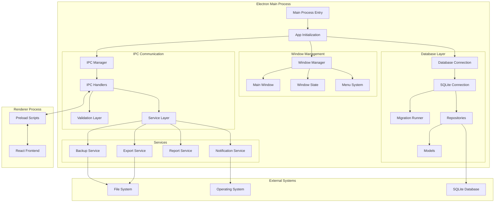

# Arquitetura Backend - Electron Main Process

[← Voltar ao Índice Principal](../README.md)

## Visão Geral

O backend da aplicação **2ª Coríntios 9** é construído sobre o **Electron Main Process**, responsável por gerenciar a aplicação desktop, comunicação IPC, acesso ao sistema de arquivos e integração com o banco de dados SQLite. Esta arquitetura garante segurança, performance e uma experiência desktop nativa.

## Tecnologias Principais

### Core Technologies
- **Electron**: Framework para aplicações desktop
- **Node.js**: Runtime JavaScript para o processo principal
- **TypeScript**: Tipagem estática e desenvolvimento robusto
- **SQLite**: Banco de dados local embarcado
- **Better-SQLite3**: Driver SQLite síncrono de alta performance

### Ferramentas de Desenvolvimento
- **Electron Builder**: Empacotamento e distribuição
- **Vite**: Build tool e bundling
- **ESLint**: Linting e qualidade de código
- **Prettier**: Formatação de código

## Estrutura de Diretórios

```
src/main/
├── index.ts                 # Ponto de entrada principal
├── app.ts                   # Configuração da aplicação
├── window/
│   ├── main-window.ts       # Gerenciamento da janela principal
│   ├── window-manager.ts    # Gerenciador de janelas
│   └── window-state.ts      # Persistência do estado das janelas
├── database/
│   ├── connection.ts        # Conexão com SQLite
│   ├── migrations/          # Scripts de migração
│   │   ├── 001-initial.sql
│   │   ├── 002-add-indexes.sql
│   │   └── migration-runner.ts
│   ├── repositories/        # Camada de acesso a dados
│   │   ├── base-repository.ts
│   │   ├── member-repository.ts
│   │   ├── tithe-repository.ts
│   │   ├── offer-repository.ts
│   │   ├── expense-repository.ts
│   │   ├── expense-category-repository.ts
│   │   ├── other-entry-repository.ts
│   │   └── church-data-repository.ts
│   └── models/              # Modelos de dados
│       ├── member.ts
│       ├── tithe.ts
│       ├── offer.ts
│       ├── expense.ts
│       ├── expense-category.ts
│       ├── other-entry.ts
│       └── church-data.ts
├── ipc/
│   ├── handlers/            # Handlers IPC por domínio
│   │   ├── member-handlers.ts
│   │   ├── tithe-handlers.ts
│   │   ├── offer-handlers.ts
│   │   ├── expense-handlers.ts
│   │   ├── expense-category-handlers.ts
│   │   ├── other-entry-handlers.ts
│   │   ├── church-data-handlers.ts
│   │   └── report-handlers.ts
│   ├── channels.ts          # Definição dos canais IPC
│   ├── ipc-manager.ts       # Gerenciador central de IPC
│   └── validation.ts        # Validação de dados IPC
├── services/
│   ├── backup-service.ts    # Serviço de backup
│   ├── export-service.ts    # Exportação de dados
│   ├── import-service.ts    # Importação de dados
│   ├── report-service.ts    # Geração de relatórios
│   └── notification-service.ts # Notificações do sistema
├── utils/
│   ├── logger.ts            # Sistema de logging
│   ├── file-utils.ts        # Utilitários de arquivo
│   ├── date-utils.ts        # Utilitários de data
│   ├── validation-utils.ts  # Validação de dados
│   └── crypto-utils.ts      # Utilitários de criptografia
├── config/
│   ├── app-config.ts        # Configurações da aplicação
│   ├── database-config.ts   # Configurações do banco
│   └── paths.ts             # Caminhos do sistema
└── types/
    ├── ipc-types.ts         # Tipos para IPC
    ├── database-types.ts    # Tipos do banco de dados
    └── app-types.ts         # Tipos gerais da aplicação
```

## Fluxo de Dados e Arquitetura



## Camadas Arquiteturais

### 1. **Camada de Apresentação (IPC Layer)**

**Responsabilidades:**
- Receber requisições do frontend via IPC
- Validar dados de entrada
- Orquestrar chamadas para a camada de serviço
- Retornar respostas formatadas

**Componentes:**
- **IPC Handlers**: Manipuladores específicos por domínio
- **Validation Layer**: Validação de entrada e saída
- **Error Handling**: Tratamento centralizado de erros

```typescript
// Exemplo de Handler IPC
export class MemberHandlers {
  constructor(
    private memberRepository: MemberRepository,
    private logger: Logger
  ) {}

  async getAllMembers(): Promise<Member[]> {
    try {
      this.logger.info('Fetching all members')
      return await this.memberRepository.findAll()
    } catch (error) {
      this.logger.error('Error fetching members:', error)
      throw new IPCError('FETCH_MEMBERS_ERROR', 'Failed to fetch members')
    }
  }

  async createMember(data: CreateMemberData): Promise<Member> {
    try {
      // Validação
      const validatedData = validateMemberData(data)
      
      // Criação
      const member = await this.memberRepository.create(validatedData)
      
      this.logger.info(`Member created: ${member.id}`)
      return member
    } catch (error) {
      this.logger.error('Error creating member:', error)
      throw new IPCError('CREATE_MEMBER_ERROR', 'Failed to create member')
    }
  }
}
```

### 2. **Camada de Serviço (Business Logic)**

**Responsabilidades:**
- Implementar regras de negócio
- Coordenar operações entre repositórios
- Gerenciar transações complexas
- Implementar funcionalidades específicas

**Componentes:**
- **Report Service**: Geração de relatórios
- **Backup Service**: Backup e restauração
- **Export/Import Services**: Importação e exportação
- **Notification Service**: Notificações do sistema

```typescript
// Exemplo de Service
export class ReportService {
  constructor(
    private memberRepo: MemberRepository,
    private titheRepo: TitheRepository,
    private offerRepo: OfferRepository,
    private expenseRepo: ExpenseRepository
  ) {}

  async generateFinancialReport(
    startDate: Date,
    endDate: Date
  ): Promise<FinancialReport> {
    const [tithes, offers, expenses] = await Promise.all([
      this.titheRepo.findByDateRange(startDate, endDate),
      this.offerRepo.findByDateRange(startDate, endDate),
      this.expenseRepo.findByDateRange(startDate, endDate)
    ])

    const totalTithes = tithes.reduce((sum, tithe) => sum + tithe.amount, 0)
    const totalOffers = offers.reduce((sum, offer) => sum + offer.amount, 0)
    const totalExpenses = expenses.reduce((sum, expense) => sum + expense.amount, 0)

    return {
      period: { startDate, endDate },
      income: {
        tithes: { total: totalTithes, count: tithes.length },
        offers: { total: totalOffers, count: offers.length },
        total: totalTithes + totalOffers
      },
      expenses: {
        total: totalExpenses,
        count: expenses.length,
        byCategory: this.groupExpensesByCategory(expenses)
      },
      balance: totalTithes + totalOffers - totalExpenses
    }
  }
}
```

### 3. **Camada de Dados (Repository Pattern)**

**Responsabilidades:**
- Abstrair acesso ao banco de dados
- Implementar operações CRUD
- Gerenciar consultas complexas
- Manter integridade dos dados

**Componentes:**
- **Base Repository**: Funcionalidades comuns
- **Specific Repositories**: Repositórios por entidade
- **Query Builders**: Construção de consultas
- **Transaction Manager**: Gerenciamento de transações

```typescript
// Base Repository
export abstract class BaseRepository<T> {
  constructor(
    protected db: Database,
    protected tableName: string
  ) {}

  async findById(id: number): Promise<T | null> {
    const stmt = this.db.prepare(`SELECT * FROM ${this.tableName} WHERE id = ?`)
    const row = stmt.get(id)
    return row ? this.mapRowToEntity(row) : null
  }

  async findAll(): Promise<T[]> {
    const stmt = this.db.prepare(`SELECT * FROM ${this.tableName} ORDER BY created_at DESC`)
    const rows = stmt.all()
    return rows.map(row => this.mapRowToEntity(row))
  }

  async create(data: Omit<T, 'id' | 'createdAt' | 'updatedAt'>): Promise<T> {
    const columns = Object.keys(data).join(', ')
    const placeholders = Object.keys(data).map(() => '?').join(', ')
    const values = Object.values(data)

    const stmt = this.db.prepare(
      `INSERT INTO ${this.tableName} (${columns}) VALUES (${placeholders})`
    )
    
    const result = stmt.run(...values)
    return this.findById(result.lastInsertRowid as number)!
  }

  protected abstract mapRowToEntity(row: any): T
}

// Repository específico
export class MemberRepository extends BaseRepository<Member> {
  constructor(db: Database) {
    super(db, 'members')
  }

  async findByName(name: string): Promise<Member[]> {
    const stmt = this.db.prepare(
      `SELECT * FROM ${this.tableName} WHERE name LIKE ? ORDER BY name`
    )
    const rows = stmt.all(`%${name}%`)
    return rows.map(row => this.mapRowToEntity(row))
  }

  async findActive(): Promise<Member[]> {
    const stmt = this.db.prepare(
      `SELECT * FROM ${this.tableName} WHERE is_active = 1 ORDER BY name`
    )
    const rows = stmt.all()
    return rows.map(row => this.mapRowToEntity(row))
  }

  protected mapRowToEntity(row: any): Member {
    return {
      id: row.id,
      name: row.name,
      email: row.email,
      phone: row.phone,
      address: row.address,
      birthDate: row.birth_date ? new Date(row.birth_date) : null,
      baptismDate: row.baptism_date ? new Date(row.baptism_date) : null,
      isActive: Boolean(row.is_active),
      createdAt: new Date(row.created_at),
      updatedAt: new Date(row.updated_at)
    }
  }
}
```

### 4. **Camada de Infraestrutura**

**Responsabilidades:**
- Gerenciar conexões com banco de dados
- Implementar sistema de logging
- Gerenciar configurações
- Prover utilitários do sistema

## Gerenciamento de Estado e Configuração

### Configuração da Aplicação

```typescript
// src/main/config/app-config.ts
export interface AppConfig {
  database: {
    path: string
    backupPath: string
    migrationPath: string
  }
  window: {
    width: number
    height: number
    minWidth: number
    minHeight: number
  }
  logging: {
    level: 'debug' | 'info' | 'warn' | 'error'
    filePath: string
    maxFileSize: number
    maxFiles: number
  }
  backup: {
    autoBackup: boolean
    backupInterval: number // em horas
    maxBackups: number
  }
}

export const getAppConfig = (): AppConfig => {
  const isDev = process.env.NODE_ENV === 'development'
  const userDataPath = app.getPath('userData')
  
  return {
    database: {
      path: path.join(userDataPath, 'database.sqlite'),
      backupPath: path.join(userDataPath, 'backups'),
      migrationPath: path.join(__dirname, 'database', 'migrations')
    },
    window: {
      width: 1200,
      height: 800,
      minWidth: 800,
      minHeight: 600
    },
    logging: {
      level: isDev ? 'debug' : 'info',
      filePath: path.join(userDataPath, 'logs'),
      maxFileSize: 10 * 1024 * 1024, // 10MB
      maxFiles: 5
    },
    backup: {
      autoBackup: true,
      backupInterval: 24, // 24 horas
      maxBackups: 30
    }
  }
}
```

### Sistema de Logging

```typescript
// src/main/utils/logger.ts
import winston from 'winston'
import path from 'path'
import { getAppConfig } from '../config/app-config'

const config = getAppConfig()

export const logger = winston.createLogger({
  level: config.logging.level,
  format: winston.format.combine(
    winston.format.timestamp(),
    winston.format.errors({ stack: true }),
    winston.format.json()
  ),
  defaultMeta: { service: '2-corintios-9-main' },
  transports: [
    // Arquivo de log
    new winston.transports.File({
      filename: path.join(config.logging.filePath, 'error.log'),
      level: 'error',
      maxsize: config.logging.maxFileSize,
      maxFiles: config.logging.maxFiles
    }),
    new winston.transports.File({
      filename: path.join(config.logging.filePath, 'combined.log'),
      maxsize: config.logging.maxFileSize,
      maxFiles: config.logging.maxFiles
    })
  ]
})

// Console em desenvolvimento
if (process.env.NODE_ENV === 'development') {
  logger.add(new winston.transports.Console({
    format: winston.format.combine(
      winston.format.colorize(),
      winston.format.simple()
    )
  }))
}

export type Logger = typeof logger
```

## Inicialização da Aplicação

### Processo de Startup

```typescript
// src/main/app.ts
export class App {
  private mainWindow: BrowserWindow | null = null
  private database: Database | null = null
  private ipcManager: IPCManager | null = null

  async initialize(): Promise<void> {
    try {
      logger.info('Initializing application...')
      
      // 1. Configurar diretórios
      await this.setupDirectories()
      
      // 2. Inicializar banco de dados
      await this.initializeDatabase()
      
      // 3. Executar migrações
      await this.runMigrations()
      
      // 4. Configurar IPC
      await this.setupIPC()
      
      // 5. Criar janela principal
      await this.createMainWindow()
      
      // 6. Configurar serviços
      await this.setupServices()
      
      logger.info('Application initialized successfully')
    } catch (error) {
      logger.error('Failed to initialize application:', error)
      throw error
    }
  }

  private async setupDirectories(): Promise<void> {
    const config = getAppConfig()
    const dirs = [
      path.dirname(config.database.path),
      config.database.backupPath,
      config.logging.filePath
    ]

    for (const dir of dirs) {
      await fs.ensureDir(dir)
    }
  }

  private async initializeDatabase(): Promise<void> {
    const config = getAppConfig()
    this.database = new Database(config.database.path)
    
    // Configurações de performance
    this.database.pragma('journal_mode = WAL')
    this.database.pragma('synchronous = NORMAL')
    this.database.pragma('cache_size = 1000')
    this.database.pragma('temp_store = MEMORY')
    
    logger.info('Database initialized')
  }

  private async runMigrations(): Promise<void> {
    const migrationRunner = new MigrationRunner(this.database!)
    await migrationRunner.runPendingMigrations()
    logger.info('Database migrations completed')
  }

  private async setupIPC(): Promise<void> {
    this.ipcManager = new IPCManager(this.database!)
    await this.ipcManager.registerHandlers()
    logger.info('IPC handlers registered')
  }

  private async createMainWindow(): Promise<void> {
    const windowManager = new WindowManager()
    this.mainWindow = await windowManager.createMainWindow()
    logger.info('Main window created')
  }

  private async setupServices(): Promise<void> {
    // Configurar backup automático
    const backupService = new BackupService(this.database!)
    await backupService.scheduleAutoBackup()
    
    // Configurar notificações
    const notificationService = new NotificationService()
    await notificationService.initialize()
    
    logger.info('Services initialized')
  }

  async shutdown(): Promise<void> {
    logger.info('Shutting down application...')
    
    try {
      // Fechar conexões
      if (this.database) {
        this.database.close()
      }
      
      // Limpar recursos
      if (this.ipcManager) {
        this.ipcManager.cleanup()
      }
      
      logger.info('Application shutdown completed')
    } catch (error) {
      logger.error('Error during shutdown:', error)
    }
  }
}
```

## Tratamento de Erros

### Sistema de Erros Customizados

```typescript
// src/main/types/errors.ts
export class IPCError extends Error {
  constructor(
    public code: string,
    message: string,
    public details?: any
  ) {
    super(message)
    this.name = 'IPCError'
  }
}

export class DatabaseError extends Error {
  constructor(
    public code: string,
    message: string,
    public query?: string,
    public params?: any[]
  ) {
    super(message)
    this.name = 'DatabaseError'
  }
}

export class ValidationError extends Error {
  constructor(
    message: string,
    public field: string,
    public value: any
  ) {
    super(message)
    this.name = 'ValidationError'
  }
}

// Error Handler Global
export const handleError = (error: Error, context: string): void => {
  logger.error(`Error in ${context}:`, {
    name: error.name,
    message: error.message,
    stack: error.stack,
    ...(error instanceof IPCError && { code: error.code, details: error.details }),
    ...(error instanceof DatabaseError && { query: error.query, params: error.params }),
    ...(error instanceof ValidationError && { field: error.field, value: error.value })
  })
}
```

## Segurança

### Medidas de Segurança Implementadas

1. **Isolamento de Contexto**
   - Preload scripts com contexto isolado
   - Comunicação apenas via IPC seguro
   - Sem acesso direto ao Node.js no renderer

2. **Validação de Dados**
   - Validação rigorosa de entrada
   - Sanitização de dados
   - Prevenção de SQL injection

3. **Controle de Acesso**
   - Permissões de arquivo restritas
   - Backup criptografado (opcional)
   - Logs de auditoria

```typescript
// Exemplo de validação segura
export const validateMemberData = (data: any): CreateMemberData => {
  const schema = {
    name: { type: 'string', required: true, maxLength: 100 },
    email: { type: 'email', required: false },
    phone: { type: 'string', required: false, maxLength: 20 },
    address: { type: 'string', required: false, maxLength: 200 }
  }

  return validateSchema(data, schema)
}
```

## Performance e Otimização

### Estratégias de Performance

1. **Database Optimization**
   - Índices apropriados
   - Consultas otimizadas
   - Connection pooling
   - WAL mode para concorrência

2. **Memory Management**
   - Cleanup de recursos
   - Garbage collection otimizado
   - Streaming para grandes datasets

3. **IPC Optimization**
   - Serialização eficiente
   - Batching de operações
   - Caching inteligente

## Monitoramento e Observabilidade

### Métricas e Logging

```typescript
// Sistema de métricas
export class MetricsCollector {
  private metrics = new Map<string, number>()

  increment(metric: string, value = 1): void {
    const current = this.metrics.get(metric) || 0
    this.metrics.set(metric, current + value)
  }

  gauge(metric: string, value: number): void {
    this.metrics.set(metric, value)
  }

  getMetrics(): Record<string, number> {
    return Object.fromEntries(this.metrics)
  }

  async logMetrics(): Promise<void> {
    const metrics = this.getMetrics()
    logger.info('Application metrics:', metrics)
  }
}
```

## Testes

### Estratégia de Testes

1. **Unit Tests**: Repositórios, serviços, utilitários
2. **Integration Tests**: IPC handlers, database operations
3. **E2E Tests**: Fluxos completos da aplicação

```typescript
// Exemplo de teste de repositório
describe('MemberRepository', () => {
  let db: Database
  let repository: MemberRepository

  beforeEach(async () => {
    db = new Database(':memory:')
    await runMigrations(db)
    repository = new MemberRepository(db)
  })

  afterEach(() => {
    db.close()
  })

  it('should create a new member', async () => {
    const memberData = {
      name: 'João Silva',
      email: 'joao@example.com',
      phone: '(11) 99999-9999'
    }

    const member = await repository.create(memberData)

    expect(member.id).toBeDefined()
    expect(member.name).toBe(memberData.name)
    expect(member.email).toBe(memberData.email)
    expect(member.createdAt).toBeInstanceOf(Date)
  })
})
```

---

**A arquitetura backend fornece uma base sólida, escalável e segura para a aplicação desktop, garantindo performance, manutenibilidade e uma excelente experiência do usuário.**
