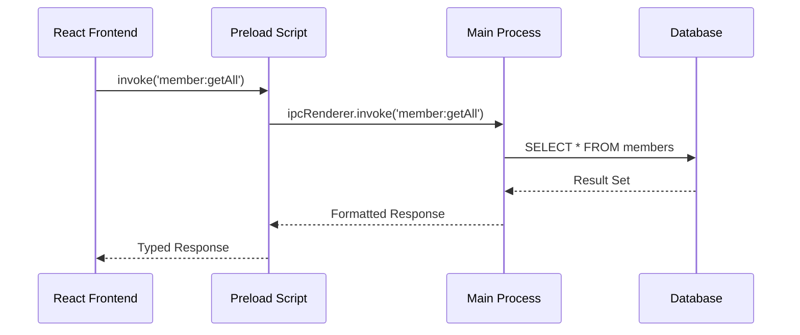

# IPC Handlers - Comunicação Entre Processos

[← Voltar ao Índice Principal](../README.md)

## Visão Geral

Os **IPC Handlers** são responsáveis pela comunicação segura entre o processo principal (Main Process) e o processo de renderização (Renderer Process) do Electron. Eles implementam uma camada de abstração que permite ao frontend React interagir com o backend Node.js de forma segura e tipada.

## Arquitetura IPC

### Fluxo de Comunicação



### Estrutura de Canais IPC

```typescript
// src/main/ipc/channels.ts
export const IPC_CHANNELS = {
  // Membros
  MEMBER: {
    GET_ALL: 'member:getAll',
    GET_BY_ID: 'member:getById',
    CREATE: 'member:create',
    UPDATE: 'member:update',
    DELETE: 'member:delete',
    SEARCH: 'member:search'
  },
  
  // Dízimos
  TITHE: {
    GET_ALL: 'tithe:getAll',
    GET_BY_ID: 'tithe:getById',
    GET_BY_MEMBER: 'tithe:getByMember',
    GET_BY_DATE_RANGE: 'tithe:getByDateRange',
    CREATE: 'tithe:create',
    UPDATE: 'tithe:update',
    DELETE: 'tithe:delete'
  },
  
  // Ofertas
  OFFER: {
    GET_ALL: 'offer:getAll',
    GET_BY_ID: 'offer:getById',
    GET_BY_DATE_RANGE: 'offer:getByDateRange',
    CREATE: 'offer:create',
    UPDATE: 'offer:update',
    DELETE: 'offer:delete'
  },
  
  // Despesas
  EXPENSE: {
    GET_ALL: 'expense:getAll',
    GET_BY_ID: 'expense:getById',
    GET_BY_CATEGORY: 'expense:getByCategory',
    GET_BY_DATE_RANGE: 'expense:getByDateRange',
    CREATE: 'expense:create',
    UPDATE: 'expense:update',
    DELETE: 'expense:delete'
  },
  
  // Categorias de Despesas
  EXPENSE_CATEGORY: {
    GET_ALL: 'expenseCategory:getAll',
    GET_BY_ID: 'expenseCategory:getById',
    CREATE: 'expenseCategory:create',
    UPDATE: 'expenseCategory:update',
    DELETE: 'expenseCategory:delete'
  },
  
  // Outras Entradas
  OTHER_ENTRY: {
    GET_ALL: 'otherEntry:getAll',
    GET_BY_ID: 'otherEntry:getById',
    GET_BY_DATE_RANGE: 'otherEntry:getByDateRange',
    CREATE: 'otherEntry:create',
    UPDATE: 'otherEntry:update',
    DELETE: 'otherEntry:delete'
  },
  
  // Dados da Igreja
  CHURCH_DATA: {
    GET: 'churchData:get',
    UPDATE: 'churchData:update'
  },
  
  // Relatórios
  REPORT: {
    FINANCIAL: 'report:financial',
    MEMBERS: 'report:members',
    TITHES: 'report:tithes',
    OFFERS: 'report:offers',
    EXPENSES: 'report:expenses'
  },
  
  // Sistema
  SYSTEM: {
    BACKUP: 'system:backup',
    RESTORE: 'system:restore',
    EXPORT: 'system:export',
    IMPORT: 'system:import'
  }
} as const
```

## Implementação dos Handlers

### Base Handler

```typescript
// src/main/ipc/handlers/base-handler.ts
import { IpcMainInvokeEvent } from 'electron'
import { Logger } from '../../utils/logger'
import { ValidationError, IPCError } from '../../types/errors'

export abstract class BaseHandler {
  constructor(
    protected logger: Logger,
    protected handlerName: string
  ) {}

  protected async handleRequest<T>(
    event: IpcMainInvokeEvent,
    operation: string,
    handler: () => Promise<T>
  ): Promise<T> {
    const startTime = Date.now()
    
    try {
      this.logger.debug(`${this.handlerName}.${operation} - Starting`)
      
      const result = await handler()
      
      const duration = Date.now() - startTime
      this.logger.debug(`${this.handlerName}.${operation} - Completed in ${duration}ms`)
      
      return result
    } catch (error) {
      const duration = Date.now() - startTime
      this.logger.error(`${this.handlerName}.${operation} - Failed in ${duration}ms:`, error)
      
      if (error instanceof ValidationError) {
        throw new IPCError('VALIDATION_ERROR', error.message, {
          field: error.field,
          value: error.value
        })
      }
      
      if (error instanceof IPCError) {
        throw error
      }
      
      throw new IPCError('INTERNAL_ERROR', 'An internal error occurred')
    }
  }

  protected validateRequired(value: any, fieldName: string): void {
    if (value === null || value === undefined || value === '') {
      throw new ValidationError(`${fieldName} is required`, fieldName, value)
    }
  }

  protected validateId(id: any): number {
    const numId = Number(id)
    if (!Number.isInteger(numId) || numId <= 0) {
      throw new ValidationError('Invalid ID format', 'id', id)
    }
    return numId
  }

  protected validateDateRange(startDate: any, endDate: any): { start: Date; end: Date } {
    const start = new Date(startDate)
    const end = new Date(endDate)
    
    if (isNaN(start.getTime())) {
      throw new ValidationError('Invalid start date', 'startDate', startDate)
    }
    
    if (isNaN(end.getTime())) {
      throw new ValidationError('Invalid end date', 'endDate', endDate)
    }
    
    if (start > end) {
      throw new ValidationError('Start date must be before end date', 'dateRange', { startDate, endDate })
    }
    
    return { start, end }
  }
}
```

### Member Handlers

```typescript
// src/main/ipc/handlers/member-handlers.ts
import { IpcMainInvokeEvent } from 'electron'
import { BaseHandler } from './base-handler'
import { MemberRepository } from '../../database/repositories/member-repository'
import { Member, CreateMemberData, UpdateMemberData } from '../../database/models/member'
import { Logger } from '../../utils/logger'

export class MemberHandlers extends BaseHandler {
  constructor(
    private memberRepository: MemberRepository,
    logger: Logger
  ) {
    super(logger, 'MemberHandlers')
  }

  async getAllMembers(event: IpcMainInvokeEvent): Promise<Member[]> {
    return this.handleRequest(event, 'getAllMembers', async () => {
      return await this.memberRepository.findAll()
    })
  }

  async getMemberById(event: IpcMainInvokeEvent, id: number): Promise<Member | null> {
    return this.handleRequest(event, 'getMemberById', async () => {
      const validId = this.validateId(id)
      return await this.memberRepository.findById(validId)
    })
  }

  async createMember(event: IpcMainInvokeEvent, data: CreateMemberData): Promise<Member> {
    return this.handleRequest(event, 'createMember', async () => {
      const validatedData = this.validateCreateMemberData(data)
      return await this.memberRepository.create(validatedData)
    })
  }

  async updateMember(event: IpcMainInvokeEvent, id: number, data: UpdateMemberData): Promise<Member> {
    return this.handleRequest(event, 'updateMember', async () => {
      const validId = this.validateId(id)
      const validatedData = this.validateUpdateMemberData(data)
      
      const existingMember = await this.memberRepository.findById(validId)
      if (!existingMember) {
        throw new IPCError('MEMBER_NOT_FOUND', `Member with ID ${validId} not found`)
      }
      
      return await this.memberRepository.update(validId, validatedData)
    })
  }

  async deleteMember(event: IpcMainInvokeEvent, id: number): Promise<boolean> {
    return this.handleRequest(event, 'deleteMember', async () => {
      const validId = this.validateId(id)
      
      const existingMember = await this.memberRepository.findById(validId)
      if (!existingMember) {
        throw new IPCError('MEMBER_NOT_FOUND', `Member with ID ${validId} not found`)
      }
      
      return await this.memberRepository.delete(validId)
    })
  }

  async searchMembers(event: IpcMainInvokeEvent, query: string): Promise<Member[]> {
    return this.handleRequest(event, 'searchMembers', async () => {
      if (!query || query.trim().length < 2) {
        throw new ValidationError('Search query must be at least 2 characters', 'query', query)
      }
      
      return await this.memberRepository.findByName(query.trim())
    })
  }

  private validateCreateMemberData(data: any): CreateMemberData {
    this.validateRequired(data.name, 'name')
    
    if (typeof data.name !== 'string' || data.name.length > 100) {
      throw new ValidationError('Name must be a string with max 100 characters', 'name', data.name)
    }
    
    if (data.email && (typeof data.email !== 'string' || !this.isValidEmail(data.email))) {
      throw new ValidationError('Invalid email format', 'email', data.email)
    }
    
    if (data.phone && typeof data.phone !== 'string') {
      throw new ValidationError('Phone must be a string', 'phone', data.phone)
    }
    
    if (data.address && typeof data.address !== 'string') {
      throw new ValidationError('Address must be a string', 'address', data.address)
    }
    
    return {
      name: data.name.trim(),
      email: data.email?.trim() || null,
      phone: data.phone?.trim() || null,
      address: data.address?.trim() || null,
      birthDate: data.birthDate ? new Date(data.birthDate) : null,
      baptismDate: data.baptismDate ? new Date(data.baptismDate) : null,
      isActive: data.isActive !== false // default true
    }
  }

  private validateUpdateMemberData(data: any): UpdateMemberData {
    const updateData: UpdateMemberData = {}
    
    if (data.name !== undefined) {
      this.validateRequired(data.name, 'name')
      if (typeof data.name !== 'string' || data.name.length > 100) {
        throw new ValidationError('Name must be a string with max 100 characters', 'name', data.name)
      }
      updateData.name = data.name.trim()
    }
    
    if (data.email !== undefined) {
      if (data.email && !this.isValidEmail(data.email)) {
        throw new ValidationError('Invalid email format', 'email', data.email)
      }
      updateData.email = data.email?.trim() || null
    }
    
    if (data.phone !== undefined) {
      updateData.phone = data.phone?.trim() || null
    }
    
    if (data.address !== undefined) {
      updateData.address = data.address?.trim() || null
    }
    
    if (data.birthDate !== undefined) {
      updateData.birthDate = data.birthDate ? new Date(data.birthDate) : null
    }
    
    if (data.baptismDate !== undefined) {
      updateData.baptismDate = data.baptismDate ? new Date(data.baptismDate) : null
    }
    
    if (data.isActive !== undefined) {
      updateData.isActive = Boolean(data.isActive)
    }
    
    return updateData
  }

  private isValidEmail(email: string): boolean {
    const emailRegex = /^[^\s@]+@[^\s@]+\.[^\s@]+$/
    return emailRegex.test(email)
  }
}
```

### Tithe Handlers

```typescript
// src/main/ipc/handlers/tithe-handlers.ts
import { IpcMainInvokeEvent } from 'electron'
import { BaseHandler } from './base-handler'
import { TitheRepository } from '../../database/repositories/tithe-repository'
import { MemberRepository } from '../../database/repositories/member-repository'
import { Tithe, CreateTitheData, UpdateTitheData } from '../../database/models/tithe'
import { Logger } from '../../utils/logger'

export class TitheHandlers extends BaseHandler {
  constructor(
    private titheRepository: TitheRepository,
    private memberRepository: MemberRepository,
    logger: Logger
  ) {
    super(logger, 'TitheHandlers')
  }

  async getAllTithes(event: IpcMainInvokeEvent): Promise<Tithe[]> {
    return this.handleRequest(event, 'getAllTithes', async () => {
      return await this.titheRepository.findAll()
    })
  }

  async getTitheById(event: IpcMainInvokeEvent, id: number): Promise<Tithe | null> {
    return this.handleRequest(event, 'getTitheById', async () => {
      const validId = this.validateId(id)
      return await this.titheRepository.findById(validId)
    })
  }

  async getTithesByMember(event: IpcMainInvokeEvent, memberId: number): Promise<Tithe[]> {
    return this.handleRequest(event, 'getTithesByMember', async () => {
      const validMemberId = this.validateId(memberId)
      
      // Verificar se o membro existe
      const member = await this.memberRepository.findById(validMemberId)
      if (!member) {
        throw new IPCError('MEMBER_NOT_FOUND', `Member with ID ${validMemberId} not found`)
      }
      
      return await this.titheRepository.findByMemberId(validMemberId)
    })
  }

  async getTithesByDateRange(
    event: IpcMainInvokeEvent,
    startDate: string,
    endDate: string
  ): Promise<Tithe[]> {
    return this.handleRequest(event, 'getTithesByDateRange', async () => {
      const { start, end } = this.validateDateRange(startDate, endDate)
      return await this.titheRepository.findByDateRange(start, end)
    })
  }

  async createTithe(event: IpcMainInvokeEvent, data: CreateTitheData): Promise<Tithe> {
    return this.handleRequest(event, 'createTithe', async () => {
      const validatedData = await this.validateCreateTitheData(data)
      return await this.titheRepository.create(validatedData)
    })
  }

  async updateTithe(event: IpcMainInvokeEvent, id: number, data: UpdateTitheData): Promise<Tithe> {
    return this.handleRequest(event, 'updateTithe', async () => {
      const validId = this.validateId(id)
      const validatedData = await this.validateUpdateTitheData(data)
      
      const existingTithe = await this.titheRepository.findById(validId)
      if (!existingTithe) {
        throw new IPCError('TITHE_NOT_FOUND', `Tithe with ID ${validId} not found`)
      }
      
      return await this.titheRepository.update(validId, validatedData)
    })
  }

  async deleteTithe(event: IpcMainInvokeEvent, id: number): Promise<boolean> {
    return this.handleRequest(event, 'deleteTithe', async () => {
      const validId = this.validateId(id)
      
      const existingTithe = await this.titheRepository.findById(validId)
      if (!existingTithe) {
        throw new IPCError('TITHE_NOT_FOUND', `Tithe with ID ${validId} not found`)
      }
      
      return await this.titheRepository.delete(validId)
    })
  }

  private async validateCreateTitheData(data: any): Promise<CreateTitheData> {
    this.validateRequired(data.memberId, 'memberId')
    this.validateRequired(data.amount, 'amount')
    this.validateRequired(data.date, 'date')
    
    const memberId = this.validateId(data.memberId)
    
    // Verificar se o membro existe
    const member = await this.memberRepository.findById(memberId)
    if (!member) {
      throw new ValidationError('Member not found', 'memberId', data.memberId)
    }
    
    const amount = Number(data.amount)
    if (!Number.isFinite(amount) || amount <= 0) {
      throw new ValidationError('Amount must be a positive number', 'amount', data.amount)
    }
    
    const date = new Date(data.date)
    if (isNaN(date.getTime())) {
      throw new ValidationError('Invalid date format', 'date', data.date)
    }
    
    return {
      memberId,
      amount,
      date,
      description: data.description?.trim() || null
    }
  }

  private async validateUpdateTitheData(data: any): Promise<UpdateTitheData> {
    const updateData: UpdateTitheData = {}
    
    if (data.memberId !== undefined) {
      const memberId = this.validateId(data.memberId)
      
      // Verificar se o membro existe
      const member = await this.memberRepository.findById(memberId)
      if (!member) {
        throw new ValidationError('Member not found', 'memberId', data.memberId)
      }
      
      updateData.memberId = memberId
    }
    
    if (data.amount !== undefined) {
      const amount = Number(data.amount)
      if (!Number.isFinite(amount) || amount <= 0) {
        throw new ValidationError('Amount must be a positive number', 'amount', data.amount)
      }
      updateData.amount = amount
    }
    
    if (data.date !== undefined) {
      const date = new Date(data.date)
      if (isNaN(date.getTime())) {
        throw new ValidationError('Invalid date format', 'date', data.date)
      }
      updateData.date = date
    }
    
    if (data.description !== undefined) {
      updateData.description = data.description?.trim() || null
    }
    
    return updateData
  }
}
```

### Report Handlers

```typescript
// src/main/ipc/handlers/report-handlers.ts
import { IpcMainInvokeEvent } from 'electron'
import { BaseHandler } from './base-handler'
import { ReportService } from '../../services/report-service'
import { 
  FinancialReport, 
  MemberReport, 
  TitheReport, 
  OfferReport, 
  ExpenseReport 
} from '../../types/reports'
import { Logger } from '../../utils/logger'

export class ReportHandlers extends BaseHandler {
  constructor(
    private reportService: ReportService,
    logger: Logger
  ) {
    super(logger, 'ReportHandlers')
  }

  async generateFinancialReport(
    event: IpcMainInvokeEvent,
    startDate: string,
    endDate: string
  ): Promise<FinancialReport> {
    return this.handleRequest(event, 'generateFinancialReport', async () => {
      const { start, end } = this.validateDateRange(startDate, endDate)
      return await this.reportService.generateFinancialReport(start, end)
    })
  }

  async generateMemberReport(event: IpcMainInvokeEvent): Promise<MemberReport> {
    return this.handleRequest(event, 'generateMemberReport', async () => {
      return await this.reportService.generateMemberReport()
    })
  }

  async generateTitheReport(
    event: IpcMainInvokeEvent,
    startDate: string,
    endDate: string,
    memberId?: number
  ): Promise<TitheReport> {
    return this.handleRequest(event, 'generateTitheReport', async () => {
      const { start, end } = this.validateDateRange(startDate, endDate)
      const validMemberId = memberId ? this.validateId(memberId) : undefined
      
      return await this.reportService.generateTitheReport(start, end, validMemberId)
    })
  }

  async generateOfferReport(
    event: IpcMainInvokeEvent,
    startDate: string,
    endDate: string
  ): Promise<OfferReport> {
    return this.handleRequest(event, 'generateOfferReport', async () => {
      const { start, end } = this.validateDateRange(startDate, endDate)
      return await this.reportService.generateOfferReport(start, end)
    })
  }

  async generateExpenseReport(
    event: IpcMainInvokeEvent,
    startDate: string,
    endDate: string,
    categoryId?: number
  ): Promise<ExpenseReport> {
    return this.handleRequest(event, 'generateExpenseReport', async () => {
      const { start, end } = this.validateDateRange(startDate, endDate)
      const validCategoryId = categoryId ? this.validateId(categoryId) : undefined
      
      return await this.reportService.generateExpenseReport(start, end, validCategoryId)
    })
  }
}
```

## Gerenciador Central de IPC

### IPC Manager

```typescript
// src/main/ipc/ipc-manager.ts
import { ipcMain, IpcMainInvokeEvent } from 'electron'
import { Database } from 'better-sqlite3'
import { Logger } from '../utils/logger'
import { IPC_CHANNELS } from './channels'

// Importar todos os handlers
import { MemberHandlers } from './handlers/member-handlers'
import { TitheHandlers } from './handlers/tithe-handlers'
import { OfferHandlers } from './handlers/offer-handlers'
import { ExpenseHandlers } from './handlers/expense-handlers'
import { ExpenseCategoryHandlers } from './handlers/expense-category-handlers'
import { OtherEntryHandlers } from './handlers/other-entry-handlers'
import { ChurchDataHandlers } from './handlers/church-data-handlers'
import { ReportHandlers } from './handlers/report-handlers'
import { SystemHandlers } from './handlers/system-handlers'

// Importar repositórios
import { MemberRepository } from '../database/repositories/member-repository'
import { TitheRepository } from '../database/repositories/tithe-repository'
import { OfferRepository } from '../database/repositories/offer-repository'
import { ExpenseRepository } from '../database/repositories/expense-repository'
import { ExpenseCategoryRepository } from '../database/repositories/expense-category-repository'
import { OtherEntryRepository } from '../database/repositories/other-entry-repository'
import { ChurchDataRepository } from '../database/repositories/church-data-repository'

// Importar serviços
import { ReportService } from '../services/report-service'
import { BackupService } from '../services/backup-service'
import { ExportService } from '../services/export-service'
import { ImportService } from '../services/import-service'

export class IPCManager {
  private memberHandlers: MemberHandlers
  private titheHandlers: TitheHandlers
  private offerHandlers: OfferHandlers
  private expenseHandlers: ExpenseHandlers
  private expenseCategoryHandlers: ExpenseCategoryHandlers
  private otherEntryHandlers: OtherEntryHandlers
  private churchDataHandlers: ChurchDataHandlers
  private reportHandlers: ReportHandlers
  private systemHandlers: SystemHandlers

  constructor(
    private database: Database,
    private logger: Logger
  ) {
    this.initializeRepositoriesAndServices()
    this.initializeHandlers()
  }

  private initializeRepositoriesAndServices(): void {
    // Repositórios
    const memberRepo = new MemberRepository(this.database)
    const titheRepo = new TitheRepository(this.database)
    const offerRepo = new OfferRepository(this.database)
    const expenseRepo = new ExpenseRepository(this.database)
    const expenseCategoryRepo = new ExpenseCategoryRepository(this.database)
    const otherEntryRepo = new OtherEntryRepository(this.database)
    const churchDataRepo = new ChurchDataRepository(this.database)

    // Serviços
    const reportService = new ReportService(
      memberRepo,
      titheRepo,
      offerRepo,
      expenseRepo,
      expenseCategoryRepo,
      otherEntryRepo
    )
    
    const backupService = new BackupService(this.database, this.logger)
    const exportService = new ExportService(
      memberRepo,
      titheRepo,
      offerRepo,
      expenseRepo,
      expenseCategoryRepo,
      otherEntryRepo,
      churchDataRepo,
      this.logger
    )
    const importService = new ImportService(this.database, this.logger)

    // Handlers
    this.memberHandlers = new MemberHandlers(memberRepo, this.logger)
    this.titheHandlers = new TitheHandlers(titheRepo, memberRepo, this.logger)
    this.offerHandlers = new OfferHandlers(offerRepo, this.logger)
    this.expenseHandlers = new ExpenseHandlers(expenseRepo, expenseCategoryRepo, this.logger)
    this.expenseCategoryHandlers = new ExpenseCategoryHandlers(expenseCategoryRepo, this.logger)
    this.otherEntryHandlers = new OtherEntryHandlers(otherEntryRepo, this.logger)
    this.churchDataHandlers = new ChurchDataHandlers(churchDataRepo, this.logger)
    this.reportHandlers = new ReportHandlers(reportService, this.logger)
    this.systemHandlers = new SystemHandlers(
      backupService,
      exportService,
      importService,
      this.logger
    )
  }

  private initializeHandlers(): void {
    this.logger.info('Initializing IPC handlers...')
    
    try {
      this.registerMemberHandlers()
      this.registerTitheHandlers()
      this.registerOfferHandlers()
      this.registerExpenseHandlers()
      this.registerExpenseCategoryHandlers()
      this.registerOtherEntryHandlers()
      this.registerChurchDataHandlers()
      this.registerReportHandlers()
      this.registerSystemHandlers()
      
      this.logger.info('IPC handlers initialized successfully')
    } catch (error) {
      this.logger.error('Failed to initialize IPC handlers:', error)
      throw error
    }
  }

  private registerMemberHandlers(): void {
    ipcMain.handle(IPC_CHANNELS.MEMBER.GET_ALL, 
      (event: IpcMainInvokeEvent) => this.memberHandlers.getAllMembers(event)
    )
    
    ipcMain.handle(IPC_CHANNELS.MEMBER.GET_BY_ID, 
      (event: IpcMainInvokeEvent, id: number) => this.memberHandlers.getMemberById(event, id)
    )
    
    ipcMain.handle(IPC_CHANNELS.MEMBER.CREATE, 
      (event: IpcMainInvokeEvent, data: any) => this.memberHandlers.createMember(event, data)
    )
    
    ipcMain.handle(IPC_CHANNELS.MEMBER.UPDATE, 
      (event: IpcMainInvokeEvent, id: number, data: any) => 
        this.memberHandlers.updateMember(event, id, data)
    )
    
    ipcMain.handle(IPC_CHANNELS.MEMBER.DELETE, 
      (event: IpcMainInvokeEvent, id: number) => this.memberHandlers.deleteMember(event, id)
    )
    
    ipcMain.handle(IPC_CHANNELS.MEMBER.SEARCH, 
      (event: IpcMainInvokeEvent, query: string) => this.memberHandlers.searchMembers(event, query)
    )
  }

  private registerTitheHandlers(): void {
    ipcMain.handle(IPC_CHANNELS.TITHE.GET_ALL, 
      (event: IpcMainInvokeEvent) => this.titheHandlers.getAllTithes(event)
    )
    
    ipcMain.handle(IPC_CHANNELS.TITHE.GET_BY_ID, 
      (event: IpcMainInvokeEvent, id: number) => this.titheHandlers.getTitheById(event, id)
    )
    
    ipcMain.handle(IPC_CHANNELS.TITHE.GET_BY_MEMBER, 
      (event: IpcMainInvokeEvent, memberId: number) => 
        this.titheHandlers.getTithesByMember(event, memberId)
    )
    
    ipcMain.handle(IPC_CHANNELS.TITHE.GET_BY_DATE_RANGE, 
      (event: IpcMainInvokeEvent, startDate: string, endDate: string) => 
        this.titheHandlers.getTithesByDateRange(event, startDate, endDate)
    )
    
    ipcMain.handle(IPC_CHANNELS.TITHE.CREATE, 
      (event: IpcMainInvokeEvent, data: any) => this.titheHandlers.createTithe(event, data)
    )
    
    ipcMain.handle(IPC_CHANNELS.TITHE.UPDATE, 
      (event: IpcMainInvokeEvent, id: number, data: any) => 
        this.titheHandlers.updateTithe(event, id, data)
    )
    
    ipcMain.handle(IPC_CHANNELS.TITHE.DELETE, 
      (event: IpcMainInvokeEvent, id: number) => this.titheHandlers.deleteTithe(event, id)
    )
  }

  private registerReportHandlers(): void {
    ipcMain.handle(IPC_CHANNELS.REPORT.FINANCIAL, 
      (event: IpcMainInvokeEvent, startDate: string, endDate: string) => 
        this.reportHandlers.generateFinancialReport(event, startDate, endDate)
    )
    
    ipcMain.handle(IPC_CHANNELS.REPORT.MEMBERS, 
      (event: IpcMainInvokeEvent) => this.reportHandlers.generateMemberReport(event)
    )
    
    ipcMain.handle(IPC_CHANNELS.REPORT.TITHES, 
      (event: IpcMainInvokeEvent, startDate: string, endDate: string, memberId?: number) => 
        this.reportHandlers.generateTitheReport(event, startDate, endDate, memberId)
    )
    
    ipcMain.handle(IPC_CHANNELS.REPORT.OFFERS, 
      (event: IpcMainInvokeEvent, startDate: string, endDate: string) => 
        this.reportHandlers.generateOfferReport(event, startDate, endDate)
    )
    
    ipcMain.handle(IPC_CHANNELS.REPORT.EXPENSES, 
      (event: IpcMainInvokeEvent, startDate: string, endDate: string, categoryId?: number) => 
        this.reportHandlers.generateExpenseReport(event, startDate, endDate, categoryId)
    )
  }

  private registerSystemHandlers(): void {
    ipcMain.handle(IPC_CHANNELS.SYSTEM.BACKUP, 
      (event: IpcMainInvokeEvent) => this.systemHandlers.createBackup(event)
    )
    
    ipcMain.handle(IPC_CHANNELS.SYSTEM.RESTORE, 
      (event: IpcMainInvokeEvent, backupPath: string) => 
        this.systemHandlers.restoreBackup(event, backupPath)
    )
    
    ipcMain.handle(IPC_CHANNELS.SYSTEM.EXPORT, 
      (event: IpcMainInvokeEvent, format: string, options: any) => 
        this.systemHandlers.exportData(event, format, options)
    )
    
    ipcMain.handle(IPC_CHANNELS.SYSTEM.IMPORT, 
      (event: IpcMainInvokeEvent, filePath: string, format: string) => 
        this.systemHandlers.importData(event, filePath, format)
    )
  }

  // Implementar outros métodos de registro...

  cleanup(): void {
    this.logger.info('Cleaning up IPC handlers...')
    
    // Remover todos os handlers
    Object.values(IPC_CHANNELS).forEach(channelGroup => {
      Object.values(channelGroup).forEach(channel => {
        ipcMain.removeAllListeners(channel)
      })
    })
    
    this.logger.info('IPC handlers cleanup completed')
  }
}
```

## Validação e Sanitização

### Sistema de Validação

```typescript
// src/main/ipc/validation.ts
import { ValidationError } from '../types/errors'

export interface ValidationRule {
  type: 'string' | 'number' | 'boolean' | 'date' | 'email' | 'array' | 'object'
  required?: boolean
  minLength?: number
  maxLength?: number
  min?: number
  max?: number
  pattern?: RegExp
  custom?: (value: any) => boolean
  message?: string
}

export interface ValidationSchema {
  [key: string]: ValidationRule
}

export class Validator {
  static validate(data: any, schema: ValidationSchema): any {
    const result: any = {}
    const errors: string[] = []

    for (const [field, rule] of Object.entries(schema)) {
      try {
        result[field] = this.validateField(data[field], field, rule)
      } catch (error) {
        if (error instanceof ValidationError) {
          errors.push(error.message)
        } else {
          errors.push(`Validation error in field ${field}`)
        }
      }
    }

    if (errors.length > 0) {
      throw new ValidationError(`Validation failed: ${errors.join(', ')}`, 'validation', errors)
    }

    return result
  }

  private static validateField(value: any, fieldName: string, rule: ValidationRule): any {
    // Verificar se é obrigatório
    if (rule.required && (value === null || value === undefined || value === '')) {
      throw new ValidationError(
        rule.message || `${fieldName} is required`,
        fieldName,
        value
      )
    }

    // Se não é obrigatório e está vazio, retornar null
    if (!rule.required && (value === null || value === undefined || value === '')) {
      return null
    }

    // Validar tipo
    switch (rule.type) {
      case 'string':
        return this.validateString(value, fieldName, rule)
      case 'number':
        return this.validateNumber(value, fieldName, rule)
      case 'boolean':
        return this.validateBoolean(value, fieldName, rule)
      case 'date':
        return this.validateDate(value, fieldName, rule)
      case 'email':
        return this.validateEmail(value, fieldName, rule)
      case 'array':
        return this.validateArray(value, fieldName, rule)
      case 'object':
        return this.validateObject(value, fieldName, rule)
      default:
        throw new ValidationError(`Unknown validation type: ${rule.type}`, fieldName, value)
    }
  }

  private static validateString(value: any, fieldName: string, rule: ValidationRule): string {
    if (typeof value !== 'string') {
      throw new ValidationError(
        rule.message || `${fieldName} must be a string`,
        fieldName,
        value
      )
    }

    const trimmed = value.trim()

    if (rule.minLength && trimmed.length < rule.minLength) {
      throw new ValidationError(
        rule.message || `${fieldName} must be at least ${rule.minLength} characters`,
        fieldName,
        value
      )
    }

    if (rule.maxLength && trimmed.length > rule.maxLength) {
      throw new ValidationError(
        rule.message || `${fieldName} must be at most ${rule.maxLength} characters`,
        fieldName,
        value
      )
    }

    if (rule.pattern && !rule.pattern.test(trimmed)) {
      throw new ValidationError(
        rule.message || `${fieldName} format is invalid`,
        fieldName,
        value
      )
    }

    if (rule.custom && !rule.custom(trimmed)) {
      throw new ValidationError(
        rule.message || `${fieldName} validation failed`,
        fieldName,
        value
      )
    }

    return trimmed
  }

  private static validateNumber(value: any, fieldName: string, rule: ValidationRule): number {
    const num = Number(value)
    
    if (!Number.isFinite(num)) {
      throw new ValidationError(
        rule.message || `${fieldName} must be a valid number`,
        fieldName,
        value
      )
    }

    if (rule.min !== undefined && num < rule.min) {
      throw new ValidationError(
        rule.message || `${fieldName} must be at least ${rule.min}`,
        fieldName,
        value
      )
    }

    if (rule.max !== undefined && num > rule.max) {
      throw new ValidationError(
        rule.message || `${fieldName} must be at most ${rule.max}`,
        fieldName,
        value
      )
    }

    if (rule.custom && !rule.custom(num)) {
      throw new ValidationError(
        rule.message || `${fieldName} validation failed`,
        fieldName,
        value
      )
    }

    return num
  }

  private static validateDate(value: any, fieldName: string, rule: ValidationRule): Date {
    const date = new Date(value)
    
    if (isNaN(date.getTime())) {
      throw new ValidationError(
        rule.message || `${fieldName} must be a valid date`,
        fieldName,
        value
      )
    }

    if (rule.custom && !rule.custom(date)) {
      throw new ValidationError(
        rule.message || `${fieldName} validation failed`,
        fieldName,
        value
      )
    }

    return date
  }

  private static validateEmail(value: any, fieldName: string, rule: ValidationRule): string {
    const email = this.validateString(value, fieldName, rule)
    const emailRegex = /^[^\s@]+@[^\s@]+\.[^\s@]+$/
    
    if (!emailRegex.test(email)) {
      throw new ValidationError(
        rule.message || `${fieldName} must be a valid email address`,
        fieldName,
        value
      )
    }

    return email
  }

  private static validateBoolean(value: any, fieldName: string, rule: ValidationRule): boolean {
    if (typeof value === 'boolean') {
      return value
    }
    
    if (typeof value === 'string') {
      const lower = value.toLowerCase()
      if (lower === 'true' || lower === '1') return true
      if (lower === 'false' || lower === '0') return false
    }
    
    if (typeof value === 'number') {
      return Boolean(value)
    }

    throw new ValidationError(
      rule.message || `${fieldName} must be a boolean`,
      fieldName,
      value
    )
  }

  private static validateArray(value: any, fieldName: string, rule: ValidationRule): any[] {
    if (!Array.isArray(value)) {
      throw new ValidationError(
        rule.message || `${fieldName} must be an array`,
        fieldName,
        value
      )
    }

    if (rule.minLength && value.length < rule.minLength) {
      throw new ValidationError(
        rule.message || `${fieldName} must have at least ${rule.minLength} items`,
        fieldName,
        value
      )
    }

    if (rule.maxLength && value.length > rule.maxLength) {
      throw new ValidationError(
        rule.message || `${fieldName} must have at most ${rule.maxLength} items`,
        fieldName,
        value
      )
    }

    return value
  }

  private static validateObject(value: any, fieldName: string, rule: ValidationRule): any {
    if (typeof value !== 'object' || value === null || Array.isArray(value)) {
      throw new ValidationError(
        rule.message || `${fieldName} must be an object`,
        fieldName,
        value
      )
    }

    return value
  }
}
```

## Tratamento de Erros

### Error Handler Middleware

```typescript
// src/main/ipc/error-handler.ts
import { IpcMainInvokeEvent } from 'electron'
import { Logger } from '../utils/logger'
import { IPCError, ValidationError, DatabaseError } from '../types/errors'

export interface IPCResponse<T = any> {
  success: boolean
  data?: T
  error?: {
    code: string
    message: string
    details?: any
  }
}

export const withErrorHandling = <T extends any[], R>(
  handler: (...args: T) => Promise<R>,
  logger: Logger,
  operationName: string
) => {
  return async (...args: T): Promise<IPCResponse<R>> => {
    const startTime = Date.now()
    
    try {
      const result = await handler(...args)
      const duration = Date.now() - startTime
      
      logger.debug(`${operationName} completed successfully in ${duration}ms`)
      
      return {
        success: true,
        data: result
      }
    } catch (error) {
      const duration = Date.now() - startTime
      
      logger.error(`${operationName} failed in ${duration}ms:`, error)
      
      if (error instanceof ValidationError) {
        return {
          success: false,
          error: {
            code: 'VALIDATION_ERROR',
            message: error.message,
            details: {
              field: error.field,
              value: error.value
            }
          }
        }
      }
      
      if (error instanceof DatabaseError) {
        return {
          success: false,
          error: {
            code: 'DATABASE_ERROR',
            message: 'A database error occurred',
            details: {
              query: error.query,
              params: error.params
            }
          }
        }
      }
      
      if (error instanceof IPCError) {
        return {
          success: false,
          error: {
            code: error.code,
            message: error.message,
            details: error.details
          }
        }
      }
      
      // Erro não tratado
      return {
        success: false,
        error: {
          code: 'INTERNAL_ERROR',
          message: 'An internal error occurred'
        }
      }
    }
  }
}
```

## Testes dos IPC Handlers

### Exemplo de Teste

```typescript
// src/main/ipc/handlers/__tests__/member-handlers.test.ts
import { Database } from 'better-sqlite3'
import { MemberHandlers } from '../member-handlers'
import { MemberRepository } from '../../database/repositories/member-repository'
import { logger } from '../../utils/logger'
import { runMigrations } from '../../database/migrations/migration-runner'

describe('MemberHandlers', () => {
  let db: Database
  let memberRepository: MemberRepository
  let memberHandlers: MemberHandlers
  let mockEvent: any

  beforeEach(async () => {
    // Criar banco em memória para testes
    db = new Database(':memory:')
    await runMigrations(db)
    
    memberRepository = new MemberRepository(db)
    memberHandlers = new MemberHandlers(memberRepository, logger)
    
    mockEvent = {
      sender: {
        id: 1
      }
    }
  })

  afterEach(() => {
    db.close()
  })

  describe('createMember', () => {
    it('should create a new member with valid data', async () => {
      const memberData = {
        name: 'João Silva',
        email: 'joao@example.com',
        phone: '(11) 99999-9999',
        address: 'Rua das Flores, 123'
      }

      const result = await memberHandlers.createMember(mockEvent, memberData)

      expect(result.id).toBeDefined()
      expect(result.name).toBe(memberData.name)
      expect(result.email).toBe(memberData.email)
      expect(result.phone).toBe(memberData.phone)
      expect(result.address).toBe(memberData.address)
      expect(result.isActive).toBe(true)
      expect(result.createdAt).toBeInstanceOf(Date)
      expect(result.updatedAt).toBeInstanceOf(Date)
    })

    it('should throw validation error for missing name', async () => {
      const memberData = {
        email: 'joao@example.com'
      }

      await expect(
        memberHandlers.createMember(mockEvent, memberData)
      ).rejects.toThrow('name is required')
    })

    it('should throw validation error for invalid email', async () => {
      const memberData = {
        name: 'João Silva',
        email: 'invalid-email'
      }

      await expect(
        memberHandlers.createMember(mockEvent, memberData)
      ).rejects.toThrow('Invalid email format')
    })
  })

  describe('getAllMembers', () => {
    it('should return all members', async () => {
      // Criar alguns membros de teste
      await memberRepository.create({
        name: 'João Silva',
        email: 'joao@example.com',
        isActive: true
      })
      
      await memberRepository.create({
        name: 'Maria Santos',
        email: 'maria@example.com',
        isActive: true
      })

      const result = await memberHandlers.getAllMembers(mockEvent)

      expect(result).toHaveLength(2)
      expect(result[0].name).toBe('Maria Santos') // Ordenado por created_at DESC
      expect(result[1].name).toBe('João Silva')
    })

    it('should return empty array when no members exist', async () => {
      const result = await memberHandlers.getAllMembers(mockEvent)
      expect(result).toHaveLength(0)
    })
  })

  describe('updateMember', () => {
    it('should update existing member', async () => {
      // Criar membro
      const member = await memberRepository.create({
        name: 'João Silva',
        email: 'joao@example.com',
        isActive: true
      })

      const updateData = {
        name: 'João Santos Silva',
        phone: '(11) 88888-8888'
      }

      const result = await memberHandlers.updateMember(mockEvent, member.id, updateData)

      expect(result.id).toBe(member.id)
      expect(result.name).toBe(updateData.name)
      expect(result.phone).toBe(updateData.phone)
      expect(result.email).toBe(member.email) // Não alterado
    })

    it('should throw error for non-existent member', async () => {
      const updateData = {
        name: 'João Santos Silva'
      }

      await expect(
        memberHandlers.updateMember(mockEvent, 999, updateData)
      ).rejects.toThrow('Member with ID 999 not found')
    })
  })
})
```

---

**Os IPC Handlers fornecem uma camada robusta e segura de comunicação entre o frontend e backend, garantindo validação de dados, tratamento de erros e performance otimizada.**
