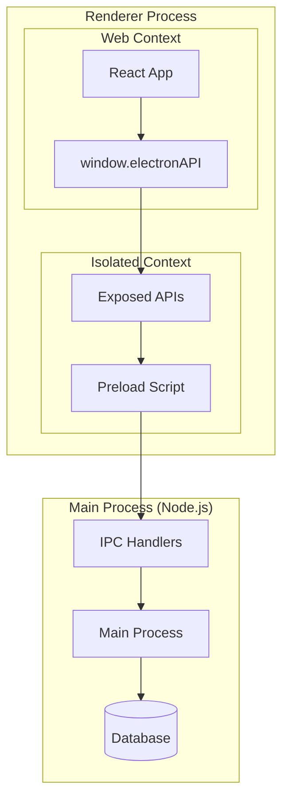

# Preload Scripts - Ponte Segura Entre Processos

[← Voltar ao Índice Principal](../README.md)

## Visão Geral

Os **Preload Scripts** são executados no contexto do processo de renderização antes que a página web seja carregada, fornecendo uma ponte segura entre o frontend React e o backend Node.js. Eles expõem APIs controladas ao contexto da janela, mantendo o isolamento de segurança do Electron.

## Arquitetura de Segurança

### Context Isolation



### Configuração de Segurança

```typescript
// src/main/main.ts
import { BrowserWindow } from 'electron'
import path from 'path'

const createWindow = (): void => {
  const mainWindow = new BrowserWindow({
    width: 1200,
    height: 800,
    webPreferences: {
      // Habilitar isolamento de contexto (padrão no Electron 20+)
      contextIsolation: true,
      
      // Desabilitar integração com Node.js no renderer
      nodeIntegration: false,
      
      // Desabilitar integração com Node.js em workers
      nodeIntegrationInWorker: false,
      
      // Desabilitar integração com Node.js em subframes
      nodeIntegrationInSubFrames: false,
      
      // Habilitar sandbox (opcional, mais restritivo)
      sandbox: false, // Definir como true para máxima segurança
      
      // Especificar o script de preload
      preload: path.join(__dirname, '../preload/preload.js')
    }
  })
}
```

## Implementação do Preload Principal

### Preload Script Base

```typescript
// src/preload/preload.ts
import { contextBridge, ipcRenderer } from 'electron'
import { IPC_CHANNELS } from '../main/ipc/channels'
import type {
  Member,
  CreateMemberData,
  UpdateMemberData,
  Tithe,
  CreateTitheData,
  UpdateTitheData,
  Offer,
  CreateOfferData,
  UpdateOfferData,
  Expense,
  CreateExpenseData,
  UpdateExpenseData,
  ExpenseCategory,
  CreateExpenseCategoryData,
  UpdateExpenseCategoryData,
  OtherEntry,
  CreateOtherEntryData,
  UpdateOtherEntryData,
  ChurchData,
  UpdateChurchData,
  FinancialReport,
  MemberReport,
  TitheReport,
  OfferReport,
  ExpenseReport
} from '../shared/types'

// Definir a interface da API que será exposta
export interface ElectronAPI {
  // Membros
  members: {
    getAll(): Promise<Member[]>
    getById(id: number): Promise<Member | null>
    create(data: CreateMemberData): Promise<Member>
    update(id: number, data: UpdateMemberData): Promise<Member>
    delete(id: number): Promise<boolean>
    search(query: string): Promise<Member[]>
  }
  
  // Dízimos
  tithes: {
    getAll(): Promise<Tithe[]>
    getById(id: number): Promise<Tithe | null>
    getByMember(memberId: number): Promise<Tithe[]>
    getByDateRange(startDate: string, endDate: string): Promise<Tithe[]>
    create(data: CreateTitheData): Promise<Tithe>
    update(id: number, data: UpdateTitheData): Promise<Tithe>
    delete(id: number): Promise<boolean>
  }
  
  // Ofertas
  offers: {
    getAll(): Promise<Offer[]>
    getById(id: number): Promise<Offer | null>
    getByDateRange(startDate: string, endDate: string): Promise<Offer[]>
    create(data: CreateOfferData): Promise<Offer>
    update(id: number, data: UpdateOfferData): Promise<Offer>
    delete(id: number): Promise<boolean>
  }
  
  // Despesas
  expenses: {
    getAll(): Promise<Expense[]>
    getById(id: number): Promise<Expense | null>
    getByCategory(categoryId: number): Promise<Expense[]>
    getByDateRange(startDate: string, endDate: string): Promise<Expense[]>
    create(data: CreateExpenseData): Promise<Expense>
    update(id: number, data: UpdateExpenseData): Promise<Expense>
    delete(id: number): Promise<boolean>
  }
  
  // Categorias de Despesas
  expenseCategories: {
    getAll(): Promise<ExpenseCategory[]>
    getById(id: number): Promise<ExpenseCategory | null>
    create(data: CreateExpenseCategoryData): Promise<ExpenseCategory>
    update(id: number, data: UpdateExpenseCategoryData): Promise<ExpenseCategory>
    delete(id: number): Promise<boolean>
  }
  
  // Outras Entradas
  otherEntries: {
    getAll(): Promise<OtherEntry[]>
    getById(id: number): Promise<OtherEntry | null>
    getByDateRange(startDate: string, endDate: string): Promise<OtherEntry[]>
    create(data: CreateOtherEntryData): Promise<OtherEntry>
    update(id: number, data: UpdateOtherEntryData): Promise<OtherEntry>
    delete(id: number): Promise<boolean>
  }
  
  // Dados da Igreja
  churchData: {
    get(): Promise<ChurchData>
    update(data: UpdateChurchData): Promise<ChurchData>
  }
  
  // Relatórios
  reports: {
    financial(startDate: string, endDate: string): Promise<FinancialReport>
    members(): Promise<MemberReport>
    tithes(startDate: string, endDate: string, memberId?: number): Promise<TitheReport>
    offers(startDate: string, endDate: string): Promise<OfferReport>
    expenses(startDate: string, endDate: string, categoryId?: number): Promise<ExpenseReport>
  }
  
  // Sistema
  system: {
    backup(): Promise<string>
    restore(backupPath: string): Promise<boolean>
    export(format: string, options: any): Promise<string>
    import(filePath: string, format: string): Promise<boolean>
  }
  
  // Utilitários
  utils: {
    showSaveDialog(options: any): Promise<string | null>
    showOpenDialog(options: any): Promise<string[] | null>
    showMessageBox(options: any): Promise<any>
    openExternal(url: string): Promise<void>
  }
}

// Implementar a API
const electronAPI: ElectronAPI = {
  // Membros
  members: {
    getAll: () => ipcRenderer.invoke(IPC_CHANNELS.MEMBER.GET_ALL),
    getById: (id: number) => ipcRenderer.invoke(IPC_CHANNELS.MEMBER.GET_BY_ID, id),
    create: (data: CreateMemberData) => ipcRenderer.invoke(IPC_CHANNELS.MEMBER.CREATE, data),
    update: (id: number, data: UpdateMemberData) => 
      ipcRenderer.invoke(IPC_CHANNELS.MEMBER.UPDATE, id, data),
    delete: (id: number) => ipcRenderer.invoke(IPC_CHANNELS.MEMBER.DELETE, id),
    search: (query: string) => ipcRenderer.invoke(IPC_CHANNELS.MEMBER.SEARCH, query)
  },
  
  // Dízimos
  tithes: {
    getAll: () => ipcRenderer.invoke(IPC_CHANNELS.TITHE.GET_ALL),
    getById: (id: number) => ipcRenderer.invoke(IPC_CHANNELS.TITHE.GET_BY_ID, id),
    getByMember: (memberId: number) => 
      ipcRenderer.invoke(IPC_CHANNELS.TITHE.GET_BY_MEMBER, memberId),
    getByDateRange: (startDate: string, endDate: string) => 
      ipcRenderer.invoke(IPC_CHANNELS.TITHE.GET_BY_DATE_RANGE, startDate, endDate),
    create: (data: CreateTitheData) => ipcRenderer.invoke(IPC_CHANNELS.TITHE.CREATE, data),
    update: (id: number, data: UpdateTitheData) => 
      ipcRenderer.invoke(IPC_CHANNELS.TITHE.UPDATE, id, data),
    delete: (id: number) => ipcRenderer.invoke(IPC_CHANNELS.TITHE.DELETE, id)
  },
  
  // Ofertas
  offers: {
    getAll: () => ipcRenderer.invoke(IPC_CHANNELS.OFFER.GET_ALL),
    getById: (id: number) => ipcRenderer.invoke(IPC_CHANNELS.OFFER.GET_BY_ID, id),
    getByDateRange: (startDate: string, endDate: string) => 
      ipcRenderer.invoke(IPC_CHANNELS.OFFER.GET_BY_DATE_RANGE, startDate, endDate),
    create: (data: CreateOfferData) => ipcRenderer.invoke(IPC_CHANNELS.OFFER.CREATE, data),
    update: (id: number, data: UpdateOfferData) => 
      ipcRenderer.invoke(IPC_CHANNELS.OFFER.UPDATE, id, data),
    delete: (id: number) => ipcRenderer.invoke(IPC_CHANNELS.OFFER.DELETE, id)
  },
  
  // Despesas
  expenses: {
    getAll: () => ipcRenderer.invoke(IPC_CHANNELS.EXPENSE.GET_ALL),
    getById: (id: number) => ipcRenderer.invoke(IPC_CHANNELS.EXPENSE.GET_BY_ID, id),
    getByCategory: (categoryId: number) => 
      ipcRenderer.invoke(IPC_CHANNELS.EXPENSE.GET_BY_CATEGORY, categoryId),
    getByDateRange: (startDate: string, endDate: string) => 
      ipcRenderer.invoke(IPC_CHANNELS.EXPENSE.GET_BY_DATE_RANGE, startDate, endDate),
    create: (data: CreateExpenseData) => ipcRenderer.invoke(IPC_CHANNELS.EXPENSE.CREATE, data),
    update: (id: number, data: UpdateExpenseData) => 
      ipcRenderer.invoke(IPC_CHANNELS.EXPENSE.UPDATE, id, data),
    delete: (id: number) => ipcRenderer.invoke(IPC_CHANNELS.EXPENSE.DELETE, id)
  },
  
  // Categorias de Despesas
  expenseCategories: {
    getAll: () => ipcRenderer.invoke(IPC_CHANNELS.EXPENSE_CATEGORY.GET_ALL),
    getById: (id: number) => ipcRenderer.invoke(IPC_CHANNELS.EXPENSE_CATEGORY.GET_BY_ID, id),
    create: (data: CreateExpenseCategoryData) => 
      ipcRenderer.invoke(IPC_CHANNELS.EXPENSE_CATEGORY.CREATE, data),
    update: (id: number, data: UpdateExpenseCategoryData) => 
      ipcRenderer.invoke(IPC_CHANNELS.EXPENSE_CATEGORY.UPDATE, id, data),
    delete: (id: number) => ipcRenderer.invoke(IPC_CHANNELS.EXPENSE_CATEGORY.DELETE, id)
  },
  
  // Outras Entradas
  otherEntries: {
    getAll: () => ipcRenderer.invoke(IPC_CHANNELS.OTHER_ENTRY.GET_ALL),
    getById: (id: number) => ipcRenderer.invoke(IPC_CHANNELS.OTHER_ENTRY.GET_BY_ID, id),
    getByDateRange: (startDate: string, endDate: string) => 
      ipcRenderer.invoke(IPC_CHANNELS.OTHER_ENTRY.GET_BY_DATE_RANGE, startDate, endDate),
    create: (data: CreateOtherEntryData) => 
      ipcRenderer.invoke(IPC_CHANNELS.OTHER_ENTRY.CREATE, data),
    update: (id: number, data: UpdateOtherEntryData) => 
      ipcRenderer.invoke(IPC_CHANNELS.OTHER_ENTRY.UPDATE, id, data),
    delete: (id: number) => ipcRenderer.invoke(IPC_CHANNELS.OTHER_ENTRY.DELETE, id)
  },
  
  // Dados da Igreja
  churchData: {
    get: () => ipcRenderer.invoke(IPC_CHANNELS.CHURCH_DATA.GET),
    update: (data: UpdateChurchData) => 
      ipcRenderer.invoke(IPC_CHANNELS.CHURCH_DATA.UPDATE, data)
  },
  
  // Relatórios
  reports: {
    financial: (startDate: string, endDate: string) => 
      ipcRenderer.invoke(IPC_CHANNELS.REPORT.FINANCIAL, startDate, endDate),
    members: () => ipcRenderer.invoke(IPC_CHANNELS.REPORT.MEMBERS),
    tithes: (startDate: string, endDate: string, memberId?: number) => 
      ipcRenderer.invoke(IPC_CHANNELS.REPORT.TITHES, startDate, endDate, memberId),
    offers: (startDate: string, endDate: string) => 
      ipcRenderer.invoke(IPC_CHANNELS.REPORT.OFFERS, startDate, endDate),
    expenses: (startDate: string, endDate: string, categoryId?: number) => 
      ipcRenderer.invoke(IPC_CHANNELS.REPORT.EXPENSES, startDate, endDate, categoryId)
  },
  
  // Sistema
  system: {
    backup: () => ipcRenderer.invoke(IPC_CHANNELS.SYSTEM.BACKUP),
    restore: (backupPath: string) => 
      ipcRenderer.invoke(IPC_CHANNELS.SYSTEM.RESTORE, backupPath),
    export: (format: string, options: any) => 
      ipcRenderer.invoke(IPC_CHANNELS.SYSTEM.EXPORT, format, options),
    import: (filePath: string, format: string) => 
      ipcRenderer.invoke(IPC_CHANNELS.SYSTEM.IMPORT, filePath, format)
  },
  
  // Utilitários
  utils: {
    showSaveDialog: (options: any) => ipcRenderer.invoke('dialog:showSaveDialog', options),
    showOpenDialog: (options: any) => ipcRenderer.invoke('dialog:showOpenDialog', options),
    showMessageBox: (options: any) => ipcRenderer.invoke('dialog:showMessageBox', options),
    openExternal: (url: string) => ipcRenderer.invoke('shell:openExternal', url)
  }
}

// Expor a API no contexto da janela
contextBridge.exposeInMainWorld('electronAPI', electronAPI)

// Declaração de tipos para TypeScript no renderer
declare global {
  interface Window {
    electronAPI: ElectronAPI
  }
}
```

## Preload Scripts Especializados

### Preload para Relatórios

```typescript
// src/preload/reports-preload.ts
import { contextBridge, ipcRenderer } from 'electron'

export interface ReportsAPI {
  // Geração de relatórios
  generate: {
    pdf(reportData: any, options: any): Promise<string>
    excel(reportData: any, options: any): Promise<string>
    csv(reportData: any, options: any): Promise<string>
  }
  
  // Visualização de relatórios
  preview: {
    pdf(filePath: string): Promise<void>
    print(filePath: string, options?: any): Promise<void>
  }
  
  // Templates de relatórios
  templates: {
    getAll(): Promise<any[]>
    getById(id: string): Promise<any>
    create(template: any): Promise<any>
    update(id: string, template: any): Promise<any>
    delete(id: string): Promise<boolean>
  }
}

const reportsAPI: ReportsAPI = {
  generate: {
    pdf: (reportData: any, options: any) => 
      ipcRenderer.invoke('reports:generatePDF', reportData, options),
    excel: (reportData: any, options: any) => 
      ipcRenderer.invoke('reports:generateExcel', reportData, options),
    csv: (reportData: any, options: any) => 
      ipcRenderer.invoke('reports:generateCSV', reportData, options)
  },
  
  preview: {
    pdf: (filePath: string) => ipcRenderer.invoke('reports:previewPDF', filePath),
    print: (filePath: string, options?: any) => 
      ipcRenderer.invoke('reports:print', filePath, options)
  },
  
  templates: {
    getAll: () => ipcRenderer.invoke('reports:templates:getAll'),
    getById: (id: string) => ipcRenderer.invoke('reports:templates:getById', id),
    create: (template: any) => ipcRenderer.invoke('reports:templates:create', template),
    update: (id: string, template: any) => 
      ipcRenderer.invoke('reports:templates:update', id, template),
    delete: (id: string) => ipcRenderer.invoke('reports:templates:delete', id)
  }
}

contextBridge.exposeInMainWorld('reportsAPI', reportsAPI)
```

### Preload para Sistema

```typescript
// src/preload/system-preload.ts
import { contextBridge, ipcRenderer } from 'electron'

export interface SystemAPI {
  // Informações do sistema
  info: {
    getVersion(): Promise<string>
    getPlatform(): Promise<string>
    getAppDataPath(): Promise<string>
    getDatabasePath(): Promise<string>
  }
  
  // Configurações
  settings: {
    get(key: string): Promise<any>
    set(key: string, value: any): Promise<void>
    getAll(): Promise<Record<string, any>>
    reset(): Promise<void>
  }
  
  // Logs
  logs: {
    get(level?: string, limit?: number): Promise<any[]>
    clear(): Promise<void>
    export(filePath: string): Promise<boolean>
  }
  
  // Atualizações
  updates: {
    check(): Promise<any>
    download(): Promise<void>
    install(): Promise<void>
    onUpdateAvailable(callback: (info: any) => void): void
    onUpdateDownloaded(callback: () => void): void
  }
  
  // Janela
  window: {
    minimize(): Promise<void>
    maximize(): Promise<void>
    close(): Promise<void>
    isMaximized(): Promise<boolean>
    setFullScreen(flag: boolean): Promise<void>
    isFullScreen(): Promise<boolean>
  }
}

const systemAPI: SystemAPI = {
  info: {
    getVersion: () => ipcRenderer.invoke('system:getVersion'),
    getPlatform: () => ipcRenderer.invoke('system:getPlatform'),
    getAppDataPath: () => ipcRenderer.invoke('system:getAppDataPath'),
    getDatabasePath: () => ipcRenderer.invoke('system:getDatabasePath')
  },
  
  settings: {
    get: (key: string) => ipcRenderer.invoke('settings:get', key),
    set: (key: string, value: any) => ipcRenderer.invoke('settings:set', key, value),
    getAll: () => ipcRenderer.invoke('settings:getAll'),
    reset: () => ipcRenderer.invoke('settings:reset')
  },
  
  logs: {
    get: (level?: string, limit?: number) => ipcRenderer.invoke('logs:get', level, limit),
    clear: () => ipcRenderer.invoke('logs:clear'),
    export: (filePath: string) => ipcRenderer.invoke('logs:export', filePath)
  },
  
  updates: {
    check: () => ipcRenderer.invoke('updates:check'),
    download: () => ipcRenderer.invoke('updates:download'),
    install: () => ipcRenderer.invoke('updates:install'),
    onUpdateAvailable: (callback: (info: any) => void) => {
      ipcRenderer.on('updates:available', (_, info) => callback(info))
    },
    onUpdateDownloaded: (callback: () => void) => {
      ipcRenderer.on('updates:downloaded', () => callback())
    }
  },
  
  window: {
    minimize: () => ipcRenderer.invoke('window:minimize'),
    maximize: () => ipcRenderer.invoke('window:maximize'),
    close: () => ipcRenderer.invoke('window:close'),
    isMaximized: () => ipcRenderer.invoke('window:isMaximized'),
    setFullScreen: (flag: boolean) => ipcRenderer.invoke('window:setFullScreen', flag),
    isFullScreen: () => ipcRenderer.invoke('window:isFullScreen')
  }
}

contextBridge.exposeInMainWorld('systemAPI', systemAPI)
```

## Wrapper de Segurança

### Safe IPC Wrapper

```typescript
// src/preload/safe-ipc-wrapper.ts
import { ipcRenderer } from 'electron'

export interface SafeIPCOptions {
  timeout?: number
  retries?: number
  validateResponse?: (response: any) => boolean
}

export class SafeIPCWrapper {
  private static readonly DEFAULT_TIMEOUT = 30000 // 30 segundos
  private static readonly DEFAULT_RETRIES = 3

  static async invoke<T>(
    channel: string,
    data?: any,
    options: SafeIPCOptions = {}
  ): Promise<T> {
    const {
      timeout = this.DEFAULT_TIMEOUT,
      retries = this.DEFAULT_RETRIES,
      validateResponse
    } = options

    let lastError: Error | null = null

    for (let attempt = 0; attempt <= retries; attempt++) {
      try {
        const response = await Promise.race([
          ipcRenderer.invoke(channel, data),
          this.createTimeoutPromise(timeout)
        ])

        // Validar resposta se fornecido validador
        if (validateResponse && !validateResponse(response)) {
          throw new Error('Response validation failed')
        }

        return response
      } catch (error) {
        lastError = error as Error
        
        // Se não é o último attempt, aguardar antes de tentar novamente
        if (attempt < retries) {
          await this.delay(Math.pow(2, attempt) * 1000) // Backoff exponencial
        }
      }
    }

    throw new Error(
      `IPC call to '${channel}' failed after ${retries + 1} attempts. Last error: ${lastError?.message}`
    )
  }

  private static createTimeoutPromise(timeout: number): Promise<never> {
    return new Promise((_, reject) => {
      setTimeout(() => {
        reject(new Error(`IPC call timed out after ${timeout}ms`))
      }, timeout)
    })
  }

  private static delay(ms: number): Promise<void> {
    return new Promise(resolve => setTimeout(resolve, ms))
  }
}

// Exemplo de uso
export const createSafeAPI = (channels: Record<string, string>) => {
  const api: Record<string, any> = {}

  for (const [method, channel] of Object.entries(channels)) {
    api[method] = (data?: any, options?: SafeIPCOptions) => 
      SafeIPCWrapper.invoke(channel, data, options)
  }

  return api
}
```

## Validação de Tipos no Preload

### Type Guards

```typescript
// src/preload/type-guards.ts
import type { Member, Tithe, Offer, Expense } from '../shared/types'

// Type guards para validação de runtime
export const isMember = (obj: any): obj is Member => {
  return (
    typeof obj === 'object' &&
    obj !== null &&
    typeof obj.id === 'number' &&
    typeof obj.name === 'string' &&
    (obj.email === null || typeof obj.email === 'string') &&
    (obj.phone === null || typeof obj.phone === 'string') &&
    (obj.address === null || typeof obj.address === 'string') &&
    (obj.birthDate === null || obj.birthDate instanceof Date) &&
    (obj.baptismDate === null || obj.baptismDate instanceof Date) &&
    typeof obj.isActive === 'boolean' &&
    obj.createdAt instanceof Date &&
    obj.updatedAt instanceof Date
  )
}

export const isMemberArray = (obj: any): obj is Member[] => {
  return Array.isArray(obj) && obj.every(isMember)
}

export const isTithe = (obj: any): obj is Tithe => {
  return (
    typeof obj === 'object' &&
    obj !== null &&
    typeof obj.id === 'number' &&
    typeof obj.memberId === 'number' &&
    typeof obj.amount === 'number' &&
    obj.date instanceof Date &&
    (obj.description === null || typeof obj.description === 'string') &&
    obj.createdAt instanceof Date &&
    obj.updatedAt instanceof Date
  )
}

export const isTitheArray = (obj: any): obj is Tithe[] => {
  return Array.isArray(obj) && obj.every(isTithe)
}

// Wrapper com validação de tipos
export const createTypedAPI = <T>(
  invoker: (channel: string, ...args: any[]) => Promise<any>,
  typeGuard: (obj: any) => obj is T
) => {
  return async (channel: string, ...args: any[]): Promise<T> => {
    const response = await invoker(channel, ...args)
    
    if (!typeGuard(response)) {
      throw new Error(`Invalid response type for channel '${channel}'`)
    }
    
    return response
  }
}
```

## Preload com Cache

### Cached Preload API

```typescript
// src/preload/cached-api.ts
import { ipcRenderer } from 'electron'

interface CacheEntry<T> {
  data: T
  timestamp: number
  ttl: number
}

export class CachedAPI {
  private cache = new Map<string, CacheEntry<any>>()
  private readonly defaultTTL = 5 * 60 * 1000 // 5 minutos

  async invoke<T>(
    channel: string,
    args?: any,
    options: { ttl?: number; forceRefresh?: boolean } = {}
  ): Promise<T> {
    const cacheKey = this.generateCacheKey(channel, args)
    const { ttl = this.defaultTTL, forceRefresh = false } = options

    // Verificar cache se não forçar refresh
    if (!forceRefresh) {
      const cached = this.getFromCache<T>(cacheKey)
      if (cached) {
        return cached
      }
    }

    // Fazer chamada IPC
    const response = await ipcRenderer.invoke(channel, args)
    
    // Armazenar no cache
    this.setCache(cacheKey, response, ttl)
    
    return response
  }

  private generateCacheKey(channel: string, args?: any): string {
    return `${channel}:${JSON.stringify(args || {})}`
  }

  private getFromCache<T>(key: string): T | null {
    const entry = this.cache.get(key)
    
    if (!entry) {
      return null
    }
    
    // Verificar se expirou
    if (Date.now() - entry.timestamp > entry.ttl) {
      this.cache.delete(key)
      return null
    }
    
    return entry.data
  }

  private setCache<T>(key: string, data: T, ttl: number): void {
    this.cache.set(key, {
      data,
      timestamp: Date.now(),
      ttl
    })
  }

  clearCache(pattern?: string): void {
    if (!pattern) {
      this.cache.clear()
      return
    }
    
    const regex = new RegExp(pattern)
    for (const key of this.cache.keys()) {
      if (regex.test(key)) {
        this.cache.delete(key)
      }
    }
  }

  getCacheStats(): { size: number; keys: string[] } {
    return {
      size: this.cache.size,
      keys: Array.from(this.cache.keys())
    }
  }
}

// Instância global do cache
export const cachedAPI = new CachedAPI()
```

## Testes dos Preload Scripts

### Exemplo de Teste

```typescript
// src/preload/__tests__/preload.test.ts
import { contextBridge, ipcRenderer } from 'electron'
import { ElectronAPI } from '../preload'

// Mock do Electron
jest.mock('electron', () => ({
  contextBridge: {
    exposeInMainWorld: jest.fn()
  },
  ipcRenderer: {
    invoke: jest.fn()
  }
}))

const mockContextBridge = contextBridge as jest.Mocked<typeof contextBridge>
const mockIpcRenderer = ipcRenderer as jest.Mocked<typeof ipcRenderer>

describe('Preload Script', () => {
  beforeEach(() => {
    jest.clearAllMocks()
  })

  it('should expose electronAPI to main world', () => {
    // Importar o preload script (isso executará o código)
    require('../preload')

    expect(mockContextBridge.exposeInMainWorld).toHaveBeenCalledWith(
      'electronAPI',
      expect.any(Object)
    )
  })

  it('should call correct IPC channel for members.getAll', async () => {
    mockIpcRenderer.invoke.mockResolvedValue([])

    // Obter a API exposta
    const [[, api]] = mockContextBridge.exposeInMainWorld.mock.calls
    const electronAPI = api as ElectronAPI

    await electronAPI.members.getAll()

    expect(mockIpcRenderer.invoke).toHaveBeenCalledWith('member:getAll')
  })

  it('should call correct IPC channel for members.create', async () => {
    const memberData = {
      name: 'João Silva',
      email: 'joao@example.com'
    }
    
    mockIpcRenderer.invoke.mockResolvedValue({ id: 1, ...memberData })

    const [[, api]] = mockContextBridge.exposeInMainWorld.mock.calls
    const electronAPI = api as ElectronAPI

    await electronAPI.members.create(memberData)

    expect(mockIpcRenderer.invoke).toHaveBeenCalledWith(
      'member:create',
      memberData
    )
  })

  it('should handle IPC errors gracefully', async () => {
    const error = new Error('IPC Error')
    mockIpcRenderer.invoke.mockRejectedValue(error)

    const [[, api]] = mockContextBridge.exposeInMainWorld.mock.calls
    const electronAPI = api as ElectronAPI

    await expect(electronAPI.members.getAll()).rejects.toThrow('IPC Error')
  })
})
```

## Configuração de Build

### Vite Config para Preload

```typescript
// electron.vite.config.ts
import { defineConfig } from 'electron-vite'
import { resolve } from 'path'

export default defineConfig({
  main: {
    build: {
      rollupOptions: {
        external: ['better-sqlite3']
      }
    }
  },
  preload: {
    build: {
      rollupOptions: {
        input: {
          // Múltiplos preload scripts
          preload: resolve(__dirname, 'src/preload/preload.ts'),
          'reports-preload': resolve(__dirname, 'src/preload/reports-preload.ts'),
          'system-preload': resolve(__dirname, 'src/preload/system-preload.ts')
        }
      }
    }
  },
  renderer: {
    // Configuração do renderer
  }
})
```

---

**Os Preload Scripts fornecem uma ponte segura e tipada entre o frontend React e o backend Node.js, mantendo o isolamento de contexto e garantindo a segurança da aplicação Electron.**
