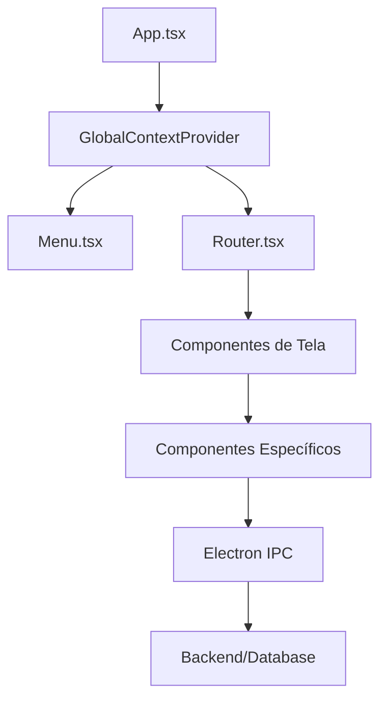

# Arquitetura Frontend - 2ª Coríntios 9

[← Voltar ao Índice Principal](../README.md)

## Visão Geral

O frontend da aplicação é construído com **React 18** e **TypeScript**, seguindo uma arquitetura modular e escalável. A estrutura é organizada por funcionalidade, facilitando a manutenção e o desenvolvimento colaborativo.

## Arquitetura Geral

### Estrutura de Diretórios

```
src/renderer/
├── @types/           # Definições de tipos TypeScript
├── components/       # Componentes React organizados por funcionalidade
├── context/          # Contextos React para gerenciamento de estado
├── styles/           # Arquivos de estilo (CSS/TailwindCSS)
├── utils/            # Funções utilitárias
├── assets/           # Recursos estáticos (imagens, ícones)
├── App.tsx           # Componente raiz da aplicação
├── Router.tsx        # Sistema de roteamento
├── Home.tsx          # Tela inicial
├── index.tsx         # Ponto de entrada do React
└── index.ejs         # Template HTML
```

### Fluxo de Dados



## Camadas da Arquitetura

### 1. **Camada de Apresentação**

**Responsabilidade:** Interface do usuário e interação

**Componentes:**
- `App.tsx` - Componente raiz
- `Menu.tsx` - Navegação principal
- `Router.tsx` - Roteamento de telas
- Componentes de UI específicos

**Características:**
- Componentes funcionais com hooks
- Estilização com TailwindCSS
- Responsividade e acessibilidade
- Feedback visual para ações do usuário

### 2. **Camada de Lógica de Negócio**

**Responsabilidade:** Regras de negócio e validações

**Componentes:**
- Hooks customizados
- Funções de validação
- Formatação de dados
- Cálculos financeiros

**Exemplo:**
```typescript
// Validação de formulário
const validateMember = (data: IMember): ValidationResult => {
  const errors: string[] = [];
  
  if (!data.name.trim()) {
    errors.push('Nome é obrigatório');
  }
  
  if (data.name.length < 2) {
    errors.push('Nome deve ter pelo menos 2 caracteres');
  }
  
  return { isValid: errors.length === 0, errors };
};
```

### 3. **Camada de Gerenciamento de Estado**

**Responsabilidade:** Estado global e local da aplicação

**Tecnologias:**
- React Context API
- useState/useReducer
- Custom hooks

**Estrutura:**
```typescript
interface GlobalContextType {
  // Dados da igreja
  churchData: IDataOfChurch | null;
  setChurchData: (data: IDataOfChurch) => void;
  
  // Saldo parcial
  partialBalance: IPartialBalance | null;
  updatePartialBalance: () => Promise<void>;
  
  // Estado de carregamento
  isLoading: boolean;
  setIsLoading: (loading: boolean) => void;
}
```

### 4. **Camada de Comunicação**

**Responsabilidade:** Comunicação com o backend via IPC

**Implementação:**
- Electron IPC através do `preload.ts`
- Handlers tipados para cada operação
- Tratamento de erros centralizado

**Exemplo:**
```typescript
// Interface exposta pelo preload
interface ElectronAPI {
  // Membros
  createMember: (member: IMember) => Promise<IMemberState>;
  getAllMembers: () => Promise<IMemberState[]>;
  updateMember: (id: number, member: IMember) => Promise<void>;
  deleteMember: (id: number) => Promise<void>;
  
  // Dízimos
  createTithe: (tithe: ITithe) => Promise<ITitheState>;
  getAllTithes: () => Promise<ITitheStateWithMemberName[]>;
  // ... outras operações
}
```

## Padrões Arquiteturais

### 1. **Component-Based Architecture**

**Princípios:**
- Componentes reutilizáveis e modulares
- Separação de responsabilidades
- Composição sobre herança
- Props tipadas com TypeScript

**Estrutura de Componente:**
```typescript
interface ComponentProps {
  // Props tipadas
}

const Component: React.FC<ComponentProps> = ({ prop1, prop2 }) => {
  // Estado local
  const [state, setState] = useState(initialValue);
  
  // Contexto global
  const { globalState } = useGlobalContext();
  
  // Efeitos
  useEffect(() => {
    // Lógica de efeito
  }, [dependencies]);
  
  // Handlers
  const handleAction = useCallback(() => {
    // Lógica do handler
  }, [dependencies]);
  
  // Render
  return (
    <div className="component-container">
      {/* JSX */}
    </div>
  );
};
```

### 2. **Container/Presentational Pattern**

**Container Components:**
- Gerenciam estado e lógica de negócio
- Fazem chamadas para APIs
- Passam dados para componentes apresentacionais

**Presentational Components:**
- Focam apenas na apresentação
- Recebem dados via props
- São reutilizáveis e testáveis

**Exemplo:**
```typescript
// Container
const MemberListContainer: React.FC = () => {
  const [members, setMembers] = useState<IMemberState[]>([]);
  const [loading, setLoading] = useState(true);
  
  useEffect(() => {
    loadMembers();
  }, []);
  
  const loadMembers = async () => {
    try {
      const data = await window.electronAPI.getAllMembers();
      setMembers(data);
    } catch (error) {
      console.error('Erro ao carregar membros:', error);
    } finally {
      setLoading(false);
    }
  };
  
  return (
    <MemberList 
      members={members} 
      loading={loading} 
      onEdit={handleEdit}
      onDelete={handleDelete}
    />
  );
};

// Presentational
interface MemberListProps {
  members: IMemberState[];
  loading: boolean;
  onEdit: (member: IMemberState) => void;
  onDelete: (id: number) => void;
}

const MemberList: React.FC<MemberListProps> = ({ 
  members, 
  loading, 
  onEdit, 
  onDelete 
}) => {
  if (loading) {
    return <LoadingSpinner />;
  }
  
  return (
    <div className="member-list">
      {members.map(member => (
        <MemberItem 
          key={member.id}
          member={member}
          onEdit={onEdit}
          onDelete={onDelete}
        />
      ))}
    </div>
  );
};
```

### 3. **Custom Hooks Pattern**

**Propósito:**
- Reutilização de lógica entre componentes
- Separação de concerns
- Testabilidade isolada

**Exemplos:**
```typescript
// Hook para gerenciamento de formulários
const useForm = <T>(initialValues: T, validationSchema?: ValidationSchema<T>) => {
  const [values, setValues] = useState<T>(initialValues);
  const [errors, setErrors] = useState<Partial<T>>({});
  const [isSubmitting, setIsSubmitting] = useState(false);
  
  const handleChange = (field: keyof T, value: any) => {
    setValues(prev => ({ ...prev, [field]: value }));
    
    // Limpar erro do campo
    if (errors[field]) {
      setErrors(prev => ({ ...prev, [field]: undefined }));
    }
  };
  
  const validate = (): boolean => {
    if (!validationSchema) return true;
    
    const validationErrors = validationSchema(values);
    setErrors(validationErrors);
    
    return Object.keys(validationErrors).length === 0;
  };
  
  const reset = () => {
    setValues(initialValues);
    setErrors({});
    setIsSubmitting(false);
  };
  
  return {
    values,
    errors,
    isSubmitting,
    setIsSubmitting,
    handleChange,
    validate,
    reset
  };
};

// Hook para operações assíncronas
const useAsync = <T>(asyncFunction: () => Promise<T>) => {
  const [data, setData] = useState<T | null>(null);
  const [loading, setLoading] = useState(false);
  const [error, setError] = useState<string | null>(null);
  
  const execute = useCallback(async () => {
    try {
      setLoading(true);
      setError(null);
      const result = await asyncFunction();
      setData(result);
      return result;
    } catch (err) {
      setError(err instanceof Error ? err.message : 'Erro desconhecido');
      throw err;
    } finally {
      setLoading(false);
    }
  }, [asyncFunction]);
  
  return { data, loading, error, execute };
};
```

## Gerenciamento de Estado

### 1. **Estado Local vs Global**

**Estado Local (useState/useReducer):**
- Dados específicos do componente
- Estado temporário de formulários
- Estados de UI (loading, modal aberto, etc.)

**Estado Global (Context API):**
- Dados da igreja
- Saldo parcial
- Configurações da aplicação
- Estado de autenticação (se aplicável)

### 2. **Context API Structure**

```typescript
// Definição do contexto
const GlobalContext = createContext<GlobalContextType | undefined>(undefined);

// Provider
const GlobalContextProvider: React.FC<{ children: React.ReactNode }> = ({ children }) => {
  const [churchData, setChurchData] = useState<IDataOfChurch | null>(null);
  const [partialBalance, setPartialBalance] = useState<IPartialBalance | null>(null);
  const [isLoading, setIsLoading] = useState(false);
  
  // Carregar dados iniciais
  useEffect(() => {
    loadInitialData();
  }, []);
  
  const loadInitialData = async () => {
    try {
      setIsLoading(true);
      
      // Carregar dados da igreja
      const church = await window.electronAPI.getChurchData();
      setChurchData(church);
      
      // Carregar saldo parcial
      await updatePartialBalance();
    } catch (error) {
      console.error('Erro ao carregar dados iniciais:', error);
    } finally {
      setIsLoading(false);
    }
  };
  
  const updatePartialBalance = async () => {
    try {
      const balance = await window.electronAPI.getPartialBalance();
      setPartialBalance(balance);
    } catch (error) {
      console.error('Erro ao atualizar saldo parcial:', error);
    }
  };
  
  const value: GlobalContextType = {
    churchData,
    setChurchData,
    partialBalance,
    updatePartialBalance,
    isLoading,
    setIsLoading
  };
  
  return (
    <GlobalContext.Provider value={value}>
      {children}
    </GlobalContext.Provider>
  );
};

// Hook customizado
const useGlobalContext = () => {
  const context = useContext(GlobalContext);
  
  if (!context) {
    throw new Error('useGlobalContext deve ser usado dentro de GlobalContextProvider');
  }
  
  return context;
};
```

## Sistema de Roteamento

### 1. **Roteamento Baseado em Estado**

```typescript
type ScreenType = 
  | 'home'
  | 'addMember'
  | 'addTithe'
  | 'addOffer'
  | 'addExpense'
  | 'addExpenseCategory'
  | 'addOtherEntry'
  | 'editMembers'
  | 'editTithes'
  | 'editOffers'
  | 'editExpenses'
  | 'editExpenseCategories'
  | 'editOtherEntries'
  | 'editWithdrawsToTheBankAccount'
  | 'generalReport'
  | 'outputReport'
  | 'dataOfChurchConfig'
  | 'balanceConfig';

const Router: React.FC<{ currentScreen: ScreenType }> = ({ currentScreen }) => {
  const renderScreen = () => {
    switch (currentScreen) {
      case 'home':
        return <Home />;
      case 'addMember':
        return <AddMember />;
      case 'addTithe':
        return <AddTithe />;
      // ... outros casos
      default:
        return <Home />;
    }
  };
  
  return (
    <div className="p-6">
      {renderScreen()}
    </div>
  );
};
```

### 2. **Navegação e Menu**

```typescript
interface MenuSection {
  title: string;
  items: MenuItem[];
}

interface MenuItem {
  id: ScreenType;
  label: string;
  icon: React.ComponentType;
}

const menuParams: MenuSection[] = [
  {
    title: 'Adicionar',
    items: [
      { id: 'addMember', label: 'Membro', icon: FaUser },
      { id: 'addTithe', label: 'Dízimo', icon: FaHandHoldingHeart },
      { id: 'addOffer', label: 'Oferta', icon: FaGift },
      // ... outros itens
    ]
  },
  // ... outras seções
];
```

## Comunicação com Backend

### 1. **Electron IPC Integration**

```typescript
// Preload script expõe APIs tipadas
const electronAPI: ElectronAPI = {
  // Membros
  createMember: (member: IMember) => ipcRenderer.invoke('create-member', member),
  getAllMembers: () => ipcRenderer.invoke('get-all-members'),
  updateMember: (id: number, member: IMember) => 
    ipcRenderer.invoke('update-member', id, member),
  deleteMember: (id: number) => ipcRenderer.invoke('delete-member', id),
  
  // Dízimos
  createTithe: (tithe: ITithe) => ipcRenderer.invoke('create-tithe', tithe),
  getAllTithes: () => ipcRenderer.invoke('get-all-tithes'),
  getTithesByMonthAndYear: (month: number, year: number) => 
    ipcRenderer.invoke('get-tithes-by-month-and-year', month, year),
  
  // ... outras operações
};

// Exposição segura no contexto do renderer
contextBridge.exposeInMainWorld('electronAPI', electronAPI);
```

### 2. **Error Handling**

```typescript
const useElectronAPI = () => {
  const handleAPICall = async <T>(
    apiCall: () => Promise<T>,
    successMessage?: string,
    errorMessage?: string
  ): Promise<T | null> => {
    try {
      const result = await apiCall();
      
      if (successMessage) {
        toast.success(successMessage);
      }
      
      return result;
    } catch (error) {
      console.error('Erro na API:', error);
      
      const message = errorMessage || 'Erro na operação';
      toast.error(message);
      
      return null;
    }
  };
  
  return { handleAPICall };
};
```

## Performance e Otimização

### 1. **Memoização**

```typescript
// Componentes memoizados
const MemberItem = React.memo<MemberItemProps>(({ member, onEdit, onDelete }) => {
  return (
    <div className="member-item">
      <span>{member.name}</span>
      <div>
        <button onClick={() => onEdit(member)}>Editar</button>
        <button onClick={() => onDelete(member.id)}>Excluir</button>
      </div>
    </div>
  );
});

// Callbacks memoizados
const MemberList: React.FC<MemberListProps> = ({ members }) => {
  const handleEdit = useCallback((member: IMemberState) => {
    // Lógica de edição
  }, []);
  
  const handleDelete = useCallback((id: number) => {
    // Lógica de exclusão
  }, []);
  
  // Valores computados memoizados
  const sortedMembers = useMemo(() => {
    return members.sort((a, b) => a.name.localeCompare(b.name));
  }, [members]);
  
  return (
    <div>
      {sortedMembers.map(member => (
        <MemberItem
          key={member.id}
          member={member}
          onEdit={handleEdit}
          onDelete={handleDelete}
        />
      ))}
    </div>
  );
};
```

### 2. **Lazy Loading**

```typescript
// Lazy loading de componentes
const ReportDocument = React.lazy(() => import('./ReportDocument'));
const AddExpense = React.lazy(() => import('./components/Add/AddExpense'));

// Uso com Suspense
const LazyComponent: React.FC = () => {
  return (
    <Suspense fallback={<LoadingSpinner />}>
      <ReportDocument />
    </Suspense>
  );
};
```

### 3. **Debouncing e Throttling**

```typescript
const useDebounce = <T>(value: T, delay: number): T => {
  const [debouncedValue, setDebouncedValue] = useState<T>(value);
  
  useEffect(() => {
    const handler = setTimeout(() => {
      setDebouncedValue(value);
    }, delay);
    
    return () => {
      clearTimeout(handler);
    };
  }, [value, delay]);
  
  return debouncedValue;
};

// Uso em busca
const SearchComponent: React.FC = () => {
  const [searchTerm, setSearchTerm] = useState('');
  const debouncedSearchTerm = useDebounce(searchTerm, 300);
  
  useEffect(() => {
    if (debouncedSearchTerm) {
      performSearch(debouncedSearchTerm);
    }
  }, [debouncedSearchTerm]);
  
  return (
    <input
      type="text"
      value={searchTerm}
      onChange={(e) => setSearchTerm(e.target.value)}
      placeholder="Buscar..."
    />
  );
};
```

## Tratamento de Erros

### 1. **Error Boundaries**

```typescript
interface ErrorBoundaryState {
  hasError: boolean;
  error?: Error;
}

class ErrorBoundary extends React.Component<
  React.PropsWithChildren<{}>,
  ErrorBoundaryState
> {
  constructor(props: React.PropsWithChildren<{}>) {
    super(props);
    this.state = { hasError: false };
  }
  
  static getDerivedStateFromError(error: Error): ErrorBoundaryState {
    return { hasError: true, error };
  }
  
  componentDidCatch(error: Error, errorInfo: React.ErrorInfo) {
    console.error('Error Boundary capturou um erro:', error, errorInfo);
  }
  
  render() {
    if (this.state.hasError) {
      return (
        <div className="error-boundary">
          <h2>Algo deu errado!</h2>
          <p>Ocorreu um erro inesperado na aplicação.</p>
          <button onClick={() => window.location.reload()}>
            Recarregar Página
          </button>
        </div>
      );
    }
    
    return this.props.children;
  }
}
```

### 2. **Global Error Handler**

```typescript
const useErrorHandler = () => {
  const handleError = useCallback((error: Error, context?: string) => {
    console.error(`Erro${context ? ` em ${context}` : ''}:`, error);
    
    // Log para serviço de monitoramento (se aplicável)
    // logErrorToService(error, context);
    
    // Notificação para o usuário
    toast.error(
      error.message || 'Ocorreu um erro inesperado'
    );
  }, []);
  
  return { handleError };
};
```

## Testes

### 1. **Estrutura de Testes**

```typescript
// Utilitários de teste
const renderWithProviders = (ui: React.ReactElement) => {
  return render(
    <GlobalContextProvider>
      <ErrorBoundary>
        {ui}
      </ErrorBoundary>
    </GlobalContextProvider>
  );
};

// Mock do Electron API
const mockElectronAPI = {
  createMember: jest.fn(),
  getAllMembers: jest.fn(),
  updateMember: jest.fn(),
  deleteMember: jest.fn(),
};

Object.defineProperty(window, 'electronAPI', {
  value: mockElectronAPI,
});
```

### 2. **Testes de Componentes**

```typescript
describe('AddMember Component', () => {
  beforeEach(() => {
    jest.clearAllMocks();
  });
  
  test('deve renderizar formulário corretamente', () => {
    renderWithProviders(<AddMember />);
    
    expect(screen.getByLabelText('Nome do Membro')).toBeInTheDocument();
    expect(screen.getByRole('button', { name: 'Salvar' })).toBeInTheDocument();
  });
  
  test('deve validar campos obrigatórios', async () => {
    renderWithProviders(<AddMember />);
    
    const submitButton = screen.getByRole('button', { name: 'Salvar' });
    fireEvent.click(submitButton);
    
    await waitFor(() => {
      expect(screen.getByText('Nome é obrigatório')).toBeInTheDocument();
    });
  });
  
  test('deve criar membro com sucesso', async () => {
    mockElectronAPI.createMember.mockResolvedValue({ id: 1, name: 'João' });
    
    renderWithProviders(<AddMember />);
    
    const nameInput = screen.getByLabelText('Nome do Membro');
    const submitButton = screen.getByRole('button', { name: 'Salvar' });
    
    fireEvent.change(nameInput, { target: { value: 'João' } });
    fireEvent.click(submitButton);
    
    await waitFor(() => {
      expect(mockElectronAPI.createMember).toHaveBeenCalledWith({ name: 'João' });
    });
  });
});
```

## Considerações de Segurança

### 1. **Sanitização de Dados**

```typescript
const sanitizeInput = (input: string): string => {
  return input
    .trim()
    .replace(/[<>"'&]/g, '') // Remove caracteres perigosos
    .substring(0, 255); // Limita tamanho
};

const validateAndSanitize = (data: any): any => {
  if (typeof data === 'string') {
    return sanitizeInput(data);
  }
  
  if (typeof data === 'object' && data !== null) {
    const sanitized: any = {};
    for (const [key, value] of Object.entries(data)) {
      sanitized[key] = validateAndSanitize(value);
    }
    return sanitized;
  }
  
  return data;
};
```

### 2. **Validação de Tipos**

```typescript
const isValidMember = (data: any): data is IMember => {
  return (
    typeof data === 'object' &&
    data !== null &&
    typeof data.name === 'string' &&
    data.name.length > 0 &&
    data.name.length <= 255
  );
};

const validateMemberData = (data: unknown): IMember => {
  if (!isValidMember(data)) {
    throw new Error('Dados de membro inválidos');
  }
  
  return {
    name: sanitizeInput(data.name)
  };
};
```

## Acessibilidade

### 1. **Navegação por Teclado**

```typescript
const AccessibleButton: React.FC<{
  onClick: () => void;
  children: React.ReactNode;
  ariaLabel?: string;
}> = ({ onClick, children, ariaLabel }) => {
  const handleKeyDown = (e: React.KeyboardEvent) => {
    if (e.key === 'Enter' || e.key === ' ') {
      e.preventDefault();
      onClick();
    }
  };
  
  return (
    <button
      onClick={onClick}
      onKeyDown={handleKeyDown}
      aria-label={ariaLabel}
      className="focus:outline-none focus:ring-2 focus:ring-blue-500"
    >
      {children}
    </button>
  );
};
```

### 2. **ARIA Labels e Roles**

```typescript
const AccessibleForm: React.FC = () => {
  const [name, setName] = useState('');
  const [nameError, setNameError] = useState('');
  
  return (
    <form role="form" aria-labelledby="form-title">
      <h2 id="form-title">Adicionar Membro</h2>
      
      <div>
        <label htmlFor="member-name" className="block text-sm font-medium">
          Nome do Membro *
        </label>
        <input
          id="member-name"
          type="text"
          value={name}
          onChange={(e) => setName(e.target.value)}
          aria-required="true"
          aria-invalid={!!nameError}
          aria-describedby={nameError ? 'name-error' : 'name-help'}
          className="mt-1 block w-full"
        />
        
        <div id="name-help" className="text-sm text-gray-500">
          Digite o nome completo do membro
        </div>
        
        {nameError && (
          <div id="name-error" role="alert" className="text-sm text-red-600">
            {nameError}
          </div>
        )}
      </div>
    </form>
  );
};
```

## Próximos Passos

### Melhorias Arquiteturais

1. **State Management**
   - Considerar Redux Toolkit para estado mais complexo
   - Implementar middleware para logging de ações
   - Cache inteligente de dados

2. **Performance**
   - Implementar virtualização para listas grandes
   - Code splitting por rotas
   - Service Workers para cache

3. **Developer Experience**
   - Storybook para documentação de componentes
   - Testes E2E com Playwright
   - Hot reload otimizado

4. **Monitoramento**
   - Error tracking (Sentry)
   - Performance monitoring
   - Analytics de uso

### Escalabilidade

1. **Micro-frontends** (se necessário)
2. **Plugin system** para extensibilidade
3. **Internacionalização** (i18n)
4. **Temas dinâmicos**

---

**Esta arquitetura fornece uma base sólida para o desenvolvimento e manutenção da aplicação, seguindo as melhores práticas do ecossistema React e garantindo escalabilidade e manutenibilidade a longo prazo.**
